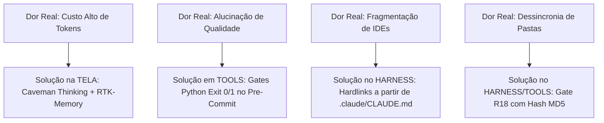

# 🏛️ Contexto de Origem: O Projeto Arsenal Open Source & Fábrica Universal

> **Finalidade Deste Documento:** Explicar o contexto do mundo real onde esta arquitetura de 4 Camadas foi concebida, testada e validada.  
> **Público:** Desenvolvedores e arquitetos que desejam entender as dores reais que moldaram este ecossistema e como replicá-lo em outros tipos de projetos (SaaS, APIs, Consultorias ou Pipelines de Dados).  
> **Localização:** `4-camadas/00-CONTEXTO-DO-PROJETO.md`

---

## 🌍 1. Qual É o Projeto Real Onde Tudo Nasceu?

Este ambiente foi construído durante a criação do **Arsenal Open Source · Hub de Soberania Tecnológica**.

### O Que Este Projeto Faz na Prática:
* **Custódia & Preservação:** Mapeia, audita licenças OSI e preserva o código-fonte de mais de **680 motores e ferramentas de código aberto** essenciais para a economia global contra riscos de descontinuidade, telemetria forçada e mudanças abusivas de licença (ex: migrações para BSL/SSPL).
* **Produção de Dossiês Técnicos:** Gera **49 compêndios especializados** em formato HTML autocontido no **Padrão Diamante / Dossiê Executivo** (cobrindo desde Economia de Tokens, RAG e Bancos de Dados até SOC/SIEM, Lakehouses e LegalTech).
* **Automação de Infraestrutura & Git:** Mantém os forks sincronizados automaticamente na organização oficial do GitHub (`@arsenal-open-source`) e garante paridade criptográfica entre os arquivos de saída (`output/listas-open-source/`) e a documentação pública (`docs/listas/`).

---

## 💥 2. O Campo de Batalha: Por Que Essa Arquitetura Foi Necessária?

Gerar e manter 49 compêndios técnicos detalhados com centenas de ferramentas ricas, comandos de terminal reais e análises financeiras de TCO é uma tarefa de **volume informacional colossal**.

Se tentássemos executar esse projeto da forma tradicional (com prompts manuais e chats soltos de IA), encontraríamos 4 catástrofes imediatas:

1. **A Falência por Consumo de Tokens:**  
   Processar centenas de ferramentas com conversas prolixas consumiria dezenas de milhares de dólares em APIs de LLMs em poucas semanas.
2. **A Degradação Silenciosa do Contexto (*Lost in the Middle*):**  
   Conforme os arquivos HTML cresciam para mais de 100 KB, o agente começava a esquecer ferramentas, truncar tabelas e misturar numerações.
3. **A Alucinação de Qualidade:**  
   O modelo de IA frequentemente "jurava" que havia gerado 20 ferramentas completas, quando na verdade havia gerado apenas 4 e omitido as outras 16 no meio do texto.
4. **A Fragmentação de IDEs:**  
   Desenvolvedores trabalhando no Cursor, no Windsurf, no Claude Code e no VS Code precisavam que as mesmas regras fossem respeitadas sem ter que copiar e colar instruções manualmente toda vez que uma regra mudasse.

---

## 🛠️ 3. Por Que o Ambiente Foi Configurado Desta Forma?

Para resolver cada uma das dores do mundo real, desenhamos a solução ancorada nas 4 Camadas:

* **A TELA foi blindada** para que a IA raciocinasse em estilo telegráfico (*Caveman*) e congelasse o prefixo de governança (*RTK*), reduzindo a fatura de tokens em até 90%.
* **O HARNESS foi blindado** com um hook de `pre-commit` com 6 gates mecânicos e links simbólicos (*Hardlinks*), garantindo portabilidade para qualquer editor de código.
* **O LLM foi isolado** como uma ferramenta de raciocínio, sem permitir que ele decida se o código está certo ou errado por conta própria.
* **A camada de TOOLS foi equipada** com scripts determinísticos em Python que calculam hashes matemáticos (MD5) e auditam o DOM das páginas antes de permitir qualquer salvamento.

---

## 🔄 4. Como Transpor e Aplicar Esses Conceitos em Outros Projetos

O que construímos aqui **não é exclusivo para catálogos ou compêndios**. O modelo das 4 Camadas é um **meta-framework universal**.

Veja como aplicar exatamente a mesma arquitetura em 3 cenários completamente diferentes:

---

### 🚀 Cenário A: Um Projeto SaaS / Backend (Ex: FastAPI + PostgreSQL + Docker)

| Camada | Como Aplicar Neste Cenário |
| :--- | :--- |
| **Camada 1 (TELA)** | Configure `.claude/CLAUDE.md` com as regras de backend (ex: *"Toda rota DEVE ter schema Pydantic, todo model DEVE ter migration Alembic e todo erro DEVE retornar JSON RFC-7807"*). Ative as 5 skills de economia. |
| **Camada 2 (HARNESS)** | No `pre-commit`, ative os gates para rodar `pytest` e checar migrações pendentes do banco de dados antes do commit. |
| **Camada 3 (LLM)** | Use modelos rápidos (*Flash / Mini*) para gerar testes unitários simples e modelos fortes (*Pro / Sonnet*) para desenhar a modelagem relacional de dados. |
| **Camada 4 (TOOLS)** | Crie scripts determinísticos em `scripts/` para subir o container de testes em Docker, rodar migrations e resetar o banco de teste automaticamente. |

---

### 🏢 Cenário B: Uma Consultoria / Fábrica de Software com Agentes de IA

| Camada | Como Aplicar Neste Cenário |
| :--- | :--- |
| **Camada 1 (TELA)** | Crie uma biblioteca de skills de domínio para sua equipe (ex: `skill-auditoria-lgpd`, `skill-code-review-react`, `skill-refatoracao-clean-arch`). |
| **Camada 2 (HARNESS)** | Use o `setup-links` para que todos os desenvolvedores da consultoria (usando Cursor, VS Code ou Windsurf) sigam o mesmo padrão de código corporativo sem divergência. |
| **Camada 3 (LLM)** | Configure saídas estruturadas com *JSON Schema* para que os relatórios gerados pelos agentes possam ser injetados diretamente no Jira ou no Notion da empresa. |
| **Camada 4 (TOOLS)** | Encapsule os linters e analisadores estáticos da empresa (*ESLint, Ruff, SonarQube*) como ferramentas determinísticas acionadas pela IA. |

---

### 📊 Cenário C: Um Pipeline de Engenharia de Dados / Analytics (Ex: DuckDB + dbt)

| Camada | Como Aplicar Neste Cenário |
| :--- | :--- |
| **Camada 1 (TELA)** | Defina regras rígidas de modelagem dimensional (ex: *"Toda tabela fato DEVE ter surrogate key, toda dimensão DEVE ter SCD Tipo 2 documentado"*). |
| **Camada 2 (HARNESS)** | Configure o `pre-commit` para rodar `dbt test` e `dbt compile` antes de permitir qualquer alteração no repositório de dados. |
| **Camada 3 (LLM)** | Use a IA para gerar queries SQL complexas forçando schema de saída em JSON para validar contra o catálogo de metadados. |
| **Camada 4 (TOOLS)** | Conecte ferramentas como `Great Expectations` e `DuckDB CLI` para validar a qualidade e volumetria das tabelas em tempo real. |

---

## 🎯 5. Síntese Filosófica da Fábrica Universal

> **"Não importa se você está construindo um catálogo open-source, um aplicativo móvel em Flutter ou uma fintech bancária em Rust:**  
> Se você controlar o que o modelo enxerga (**TELA**), como o loop de execução é contido (**HARNESS**), como o raciocínio é selecionado (**LLM**) e como as ferramentas reais operam determinismo (**TOOLS**), o seu software será produzido com **qualidade industrial, velocidade sobre-humana e custo desprezível**."
