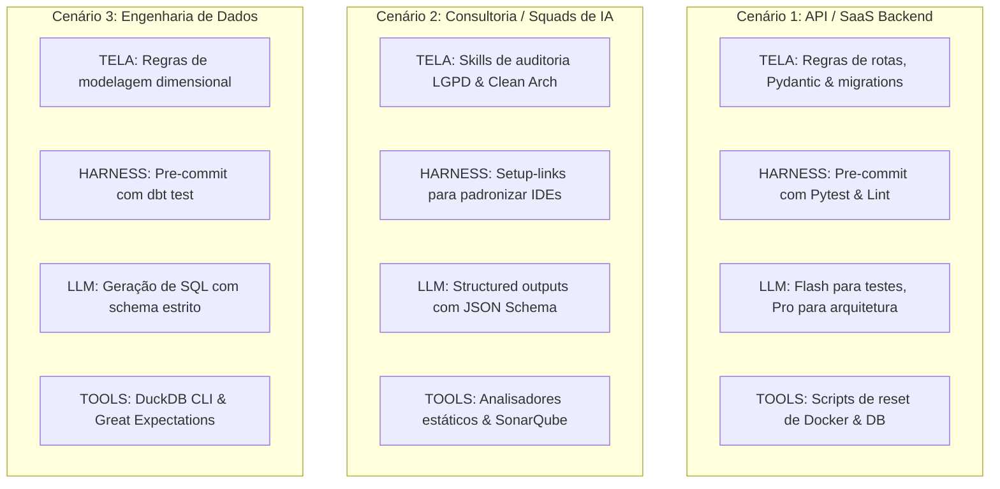

# 📖 O Tratado das 4 Camadas da Fábrica Agêntica
## Guia Definitivo de Arquitetura, Soberania e Engenharia de Software com Inteligência Artificial

> **Autor:** Fábrica Universal  
> **Público-Alvo:** Desenvolvedores iniciantes, engenheiros seniores, arquitetos de software e líderes de tecnologia que não são da área de programação.  
> **Objetivo:** Ensinar os princípios fundamentais, a física computacional e a engenharia prática para governar agentes de IA em qualquer projeto de software (novo ou legado) com custo quase zero e 100% de previsibilidade industrial.

---

# 📑 Sumário Geral

1. [Prefácio: A Crise do Desenvolvimento com IA](#prefácio-a-crise-do-desenvolvimento-com-ia)
2. [O Dicionário do Iniciante (Glossário Descomplicado)](#o-dicionário-do-iniciante-glossário-descomplicado)
3. [Capítulo 0: O Contexto Real de Origem (O Campo de Batalha)](#capítulo-0-o-contexto-real-de-origem-o-campo-de-batalha)
   - 0.1 O Projeto Arsenal Open Source
   - 0.2 As 4 Dores Reais Enfrentadas
   - 0.3 Matriz de Transposição para Outros Projetos (SaaS, Consultorias, Pipelines de Dados)
4. [Capítulo 1: Camada 1 — TELA (Prompt & Context Engineering)](#capítulo-1-camada-1--tela-prompt--context-engineering)
   - 1.1 Os 3 Princípios Universais e Imutáveis da TELA
   - 1.2 A Constituição Mestre: As 18 Regras Sagradas (R1 a R18)
   - 1.3 O Motor de Economia Severa de Tokens (As 5 Skills Fundamentais)
   - 1.4 Vocabulário Controlado e Orçamento de Cache
   - 1.5 Como Implementar e Replicar a Camada 1
5. [Capítulo 2: Camada 2 — HARNESS (Harness & Loop Engineering)](#capítulo-2-camada-2--harness-harness--loop-engineering)
   - 2.1 Os 3 Princípios Universais e Imutáveis do HARNESS
   - 2.2 Configuração Industrial: Circuit Breakers e Sandbox
   - 2.3 O Guarda-Costas do Git: Pre-Commit com 6 Gates de Inspeção
   - 2.4 A Mágica dos Hardlinks na Portabilidade Multi-IDE
   - 2.5 Como Implementar e Replicar a Camada 2
6. [Capítulo 3: Camada 3 — LLM (Model Layer & Semantic Routing)](#capítulo-3-camada-3--llm-model-layer--semantic-routing)
   - 3.1 Os 3 Princípios Universais e Imutáveis do LLM
   - 3.2 O Roteamento por Pareto: A Matriz de 3 Tiers de Modelos
   - 3.3 Contratos Tipados Estritos: Structured Outputs via JSON Schema
   - 3.4 Registro Declarativo de Tipos e Custos (`tipos.py`)
   - 3.5 Como Implementar e Replicar a Camada 3
7. [Capítulo 4: Camada 4 — TOOLS (MCP Servers & Determinismo Mecânico)](#capítulo-4-camada-4--tools-mcp-servers--determinismo-mecânico)
   - 4.1 Os 3 Princípios Universais e Imutáveis de TOOLS
   - 4.2 O Banco de Dados de Estado Persistente SQLite R11
   - 4.3 Servidores MCP e a Usina de Scripts Determinísticos
   - 4.4 Como Implementar e Replicar a Camada 4
8. [Capítulo 5: O Super-Auditor e a Validação Matemática das 4 Camadas](#capítulo-5-o-super-auditor-e-a-validação-matemática-das-4-camadas)
9. [Capítulo 6: O Manual de Montagem Universal (Passo a Passo)](#capítulo-6-o-manual-de-montagem-universal-passo-a-passo)

---

# Prefácio: A Crise do Desenvolvimento com IA

Quando você começa a programar usando Inteligência Artificial (seja com Claude Code, Cursor, Copilot ou ChatGPT), você experimenta uma sensação mágica de produtividade nos primeiros 10 minutos.

Porém, conforme o projeto passa de um simples script para um sistema real com dezenas de arquivos, **quatro problemas catastróficos surgem**:

1. **A Fatura Explosiva:** A IA começa a ler o histórico repetidamente e a pensar de forma prolixa. Em poucos dias, pequenas equipes gastam centenas ou milhares de dólares em APIs de LLMs.
2. **A Amnésia Progressiva (*Lost in the Middle*):** Conforme o projeto cresce, a IA começa a esquecer o que foi combinado no início, contradiz regras anteriores e remove trechos de código que estavam funcionando.
3. **A Alucinação de Sucesso:** A IA afirma com tom solene que *"o código foi corrigido com perfeição"*, mas ao tentar executar, o sistema nem sequer inicia ou quebra no primeiro comando.
4. **O Caos de Configuração (Vendor Lock-in):** Cada editor de código exige um arquivo diferente (`CLAUDE.md`, `.cursorrules`, `.windsurfrules`). Mudar de ideia ou de ferramenta vira um pesadelo manual de sincronização.

Este livro apresenta a **solução definitiva de engenharia para esses quatro problemas**: a **Arquitetura das 4 Camadas da Fábrica Agêntica (TELA, HARNESS, LLM e TOOLS)**.

---

# O Dicionário do Iniciante (Glossário Descomplicado)

Para que qualquer pessoa — mesmo sem experiência prévia em tecnologia — possa dominar este material, aqui estão os conceitos fundamentais explicados com analogias do dia a dia:

* **IA / LLM (Large Language Model):** É o cérebro probabilístico da máquina. Pense nele como um digitador ultrarrápido que tenta adivinhar as palavras mais adequadas com base no que leu anteriormente.
* **Token:** É a "moeda" e o combustível da IA. Um token equivale a cerca de 4 letras de uma palavra em português. Toda palavra enviada para a IA (entrada) e toda palavra respondida (saída) é cobrada em tokens.
* **Contexto (Context Window):** É a "memória de curto prazo" da IA. É o total de palavras que ela consegue "enxergar" em uma única conversa. Se o contexto ficar entulhado de lixo, a IA fica lerda, cara e esquecida.
* **KV-Cache (Prompt Caching):** Uma tecnologia de aceleração dos provedores de IA. Se o início do seu texto de instruções for **100% idêntico** ao das mensagens anteriores, o computador reaproveita o cálculo e cobra até **90% mais barato** por aquele trecho.
* **ADE (Agentic Development Environment):** O ambiente onde os agentes trabalham (como Antigravity, Orca, Claude Code).
* **Git & Commit:** O Git é a máquina do tempo do código. Fazer um *commit* é tirar uma fotografia imutável do projeto com uma mensagem explicativa.
* **Pre-Commit Hook:** Um "segurança digital" no computador que inspeciona o código antes do salvamento. Se encontrar defeito, ele **bloqueia o commit na hora**.
* **Exit Code (0 ou 1):** A linguagem binária do sistema operacional. `Exit 0` significa **Sucesso Total / Aprovado**. `Exit 1` significa **Erro / Reprovado**.
* **Hardlink / Junction:** Portais mágicos do sistema de arquivos. Permitem que um arquivo exista fisicamente em um único lugar no disco rígido, mas apareça simultaneamente em 5 pastas diferentes.
* **MCP (Model Context Protocol):** Um padrão universal da indústria que permite à IA conversar com bancos de dados, navegadores e ferramentas externas de forma padronizada e segura.

---

# Capítulo 0: O Contexto Real de Origem (O Campo de Batalha)

## 0.1 O Projeto Arsenal Open Source
Esta arquitetura não nasceu em um laboratório teórico. Ela foi forjada no campo de batalha durante a construção do **Arsenal Open Source & Fábrica Universal**.

O objetivo deste projeto era auditar, custodiar o código-fonte e produzir **49 compêndios técnicos especializados** no **Padrão Dossiê Executivo (Padrão Diamante)**, cobrindo mais de **680 motores de código aberto** (bancos de dados, SOC/SIEM, Lakehouses, IA de Borda, etc.) e sincronizando os forks automaticamente no GitHub.

## 0.2 As 4 Dores Reais Enfrentadas
* Processar mais de 680 ferramentas gastaria dezenas de milhares de reais se a IA pensasse de forma prolixa.
* Ao gerar arquivos HTML de mais de 100 KB, o modelo de IA esquecia ferramentas e omitia fichas técnicas.
* A IA frequentemente alucinava que havia validado o código.
* Desenvolvedores precisavam alternar entre Claude Code, Cursor e VS Code sem perder regras.

## 0.3 Matriz de Transposição para Outros Projetos
O modelo das 4 Camadas é universal. Veja como aplicá-lo em qualquer área:



---

# Capítulo 1: Camada 1 — TELA (Prompt & Context Engineering)

> **Papel no Estúdio:** O Mixer (O que a IA vê, o que ela sabe e como ela raciocina).

## 1.1 Os 3 Princípios Universais e Imutáveis da TELA

1. **Princípio da Invariância de Prefixo (*KV-Cache Invariance*):**  
   Se o arquivo mestre de governança (`CLAUDE.md`) permanecer 100% estático, o hardware dos provedores de LLM reutiliza os cálculos anteriores, gerando **90% de desconto financeiro** em todas as mensagens.
2. **Princípio da Densidade de Shannon (*Zero Entropia Prolixa*):**  
   Ruído degrada sinal. Eliminar saudações e conversas vazias reduz a taxa de alucinação a zero.
3. **Princípio da Localidade de Contexto (*Context Locality*):**  
   Buscar trechos cirúrgicos via `grep` evita o fenômeno *Lost in the Middle* (esquecimento no meio de arquivos gigantes).

## 1.2 A Constituição Mestre: As 18 Regras Sagradas (R1 a R18)

| Regra | Nome | O Que Faz na Prática |
| :--- | :--- | :--- |
| **R1** | **Idioma Único (PT-BR)** | Comunicação, documentação e comentários em português estrito. |
| **R2** | **Silenciamento de Prosa** | Sem preâmbulos vazios ("Com certeza!"). Markdown limpo. |
| **R3/R4** | **Autonomia & Auto-Correção** | A esteira resolve desvios e corrige erros antes de entregar ao operador. |
| **R5** | **Padrão Diamante** | Dossiê visual com Hero Stats, 4 seções verticais nos cards e 3 passos em mini-cards. |
| **R6** | **Modelo Livre** | `model: inherit` — o projeto não fica refém de uma LLM específica. |
| **R7** | **Conteúdo Intocável** | Documentos de entrega final nunca são resumidos ou truncados. |
| **R8/R9** | **Determinismo & Gates** | Se um script resolve, não gaste IA. Gates retornam `exit 0` ou `exit 1`. |
| **R10/R11**| **Idempotência & Estado em Disco**| Scripts podem rodar 1.000 vezes sem quebrar; estado vive em SQLite. |
| **R12-R14**| **Registro Único, Sem `_` e Caminhos Curtos**| 1 entrada em `tipos.py` por novo artefato; compatibilidade Windows (<260 chars). |
| **R15/R16**| **Segredos & Testes Verdes**| Git bloqueia chaves de API e proíbe commits com testes quebrados. |
| **R17** | **Etapas Opcionais** | Etapas opcionais nunca travam o fluxo de trabalho. |
| **R18** | **Higiene & Paridade Estrita**| Zero arquivos temporários (`temp_*`, `.bak`); espelhos com mesmo hash MD5. |

## 1.3 As 5 Skills Fundamentais de Economia Severa
1. **`caveman`:** Raciocínio telegráfico no bloco interno `<thought>` ("usr quer X. ler Y. corrigir Z."). Economiza até 90% do processamento mental da IA.
2. **`headroom`:** Corta logs gigantes de terminal mantendo 3 linhas no topo e 4 no fim.
3. **`lean-ctx`:** Força o uso de `grep` antes de abrir arquivos.
4. **`rtk-memory`:** Joga aprendizados em `RTK-SCRATCHPAD.md` e mantém o prompt mestre congelado.
5. **`pre-flight-check`:** Checklist de 3 perguntas antes de refatorar código.

## 1.4 Como Replicar a Camada 1
```bash
cp -r fabrica-universal/.claude/ .
cp fabrica-universal/RTK-SCRATCHPAD.md .
cp fabrica-universal/scripts/auditar_camada_tela.py scripts/
python scripts/auditar_camada_tela.py
# -> Saída: Exit 0 (100% Aprovado)
```

---

# Capítulo 2: Camada 2 — HARNESS (Harness & Loop Engineering)

> **Papel no Estúdio:** O Sistema de Segurança, Cabos e Disjuntores.

## 2.1 Os 3 Princípios Universais e Imutáveis do HARNESS

1. **Princípio do Disjuntor (*Circuit Breaker & Halting Problem*):**  
   Agentes em loop podem travar no Problema da Parada de Turing. É obrigatório impor travas duras de interrupção mecânica (`max_loop_iterations: 25`, timeout: 60s).
2. **Princípio do Privilégio Mínimo & Sandbox Reversível:**  
   Comandos destrutivos (`rm -rf /`, `mkfs`) e comandos que alteram o diretório de trabalho (`cd`) são bloqueados no nível do processo.
3. **Princípio do Ponto Único de Verdade (*Hardlinks no Sistema de Arquivos*):**  
   A governança vive em `.claude/CLAUDE.md` e é linkada no disco rígido para todas as outras IDEs.

## 2.2 Configuração Industrial de `.claude/settings.json`
```json
{
  "harness": {
    "circuit_breaker": {
      "max_loop_iterations": 25,
      "command_timeout_seconds": 60
    },
    "sandbox": {
      "disallow_shell_cd": true,
      "require_confirmation_on_destructive": true
    }
  }
}
```

## 2.3 O Pre-Commit com 6 Gates de Proteção
O script `.git/hooks/pre-commit` inspeciona cada tentativa de gravação no Git:
* **Gate 1:** Varredura de chaves de API e segredos privados (R15).
* **Gate 2:** Execução da suíte de testes Python (`pytest`) (R16).
* **Gate 3:** Execução dos testes Node.js (`npm test`).
* **Gate 4:** Compilação sintática contra erros de digitação.
* **Gate 5:** Atualização do grafo de dependências do projeto.
* **Gate 6:** Auditoria criptográfica de higiene e paridade de hash MD5 (R18).

## 2.4 Como Replicar a Camada 2
```bash
cp fabrica-universal/.claude/settings.json .claude/
cp fabrica-universal/scripts/hooks/pre-commit scripts/hooks/
cp fabrica-universal/scripts/setup-links.* scripts/
cp fabrica-universal/scripts/auditar_camada_harness.py scripts/
powershell .\scripts\setup-links.ps1 meu-projeto   # Linux: bash scripts/setup-links.sh meu-projeto
python scripts/auditar_camada_harness.py
# -> Saída: Exit 0 (100% Aprovado)
```

---

# Capítulo 3: Camada 3 — LLM (Model Layer & Semantic Routing)

> **Papel no Estúdio:** O Músico, o Instrumento e a Cognição Probabilística.

## 3.1 Os 3 Princípios Universais e Imutáveis do LLM

1. **Princípio do Roteamento por Pareto (*Capacidade vs Custo Exponencial*):**  
   80% das tarefas (buscar, ler, checar) rodam em modelos rápidos e baratos (Tier 1). Apenas 20% das tarefas (arquitetura e bugs profundos) utilizam modelos de raciocínio pesado (Tier 3).
2. **Princípio do Contrato Tipado Estrito (*Structured Outputs via Schema*):**  
   Nunca confie em texto livre gerado por IA para alimentar código. Force respostas estruturadas validadas contra *JSON Schemas*.
3. **Princípio da Degradação Graciosa (*Fallbacks*):**  
   Se um provedor de nuvem sofrer *Rate Limit (HTTP 429)*, o sistema chaveia automaticamente para um modelo de contingência.

## 3.2 A Matriz de 3 Tiers de Modelos (`scripts/roteador_llm.py`)
* **Tier 1 (Rápido / Barato - 1x Custo):** *Gemini Flash / Claude Haiku / GPT-4o Mini* (Buscas `grep`, leitura de arquivos, checagem sintática).
* **Tier 2 (Código & Testes - 10x Custo):** *Claude 3.7 Sonnet / GPT-4o / Gemini Pro* (Código-fonte, refatorações, dossiês).
* **Tier 3 (Raciocínio Pesado - 30x Custo):** *Sonnet Thinking / Pro Thinking / o3-mini* (Decisões de arquitetura e bugs complexos).

## 3.3 Contratos JSON Schema em `scripts/schemas/`
Garantem que os dados de ferramentas (`schema_ferramenta.json`) e relatórios de encerramento (`schema_relatorio.json`) contenham tipos estritos antes de serem aceitos pelo sistema.

## 3.4 Como Replicar a Camada 3
```bash
mkdir -p scripts/schemas
cp fabrica-universal/scripts/roteador_llm.py scripts/
cp fabrica-universal/scripts/tipos.py scripts/
cp fabrica-universal/scripts/schemas/* scripts/schemas/
cp fabrica-universal/scripts/auditar_camada_llm.py scripts/
python scripts/auditar_camada_llm.py
# -> Saída: Exit 0 (100% Aprovado)
```

---

# Capítulo 4: Camada 4 — TOOLS (MCP Servers & Determinismo Mecânico)

> **Papel no Estúdio:** Os Pedais de Efeitos, Instrumentos e Processadores de Precisão.

## 4.1 Os 3 Princípios Universais e Imutáveis de TOOLS

1. **Princípio da Separação de Responsabilidades (*LLM Pensa, Tool Executa*):**  
   A IA não deve fazer matemática, contar itens ou verificar arquivos em prosa. Uma ferramenta de computador deve executar e retornar o código binário `exit 0` ou `exit 1`.
2. **Princípio da Idempotência Algorítmica ($f(f(x)) = f(x)$):**  
   Um script de saneamento deve produzir o mesmo estado perfeito se rodar 1 vez ou 1.000 vezes consecutivas.
3. **Princípio da Paridade de Hash (*Auditoria Criptográfica*):**  
   Garante que os arquivos de saída (`output/`) e a documentação pública (`docs/`) possuam o mesmo hash criptográfico MD5.

## 4.2 O Banco de Estado Persistente SQLite R11 (`estado_esteira.db`)
Módulo Python (`scripts/estado_esteira.py`) que armazena em tabelas relacionais locais:
* Histórico de sessões de trabalho;
* Registro de todas as auditorias e gates aprovados/reprovados;
* Catálogo de ferramentas preservadas.

## 4.3 Como Replicar a Camada 4
```bash
cp fabrica-universal/.mcp.json .
cp fabrica-universal/scripts/estado_esteira.py scripts/
cp fabrica-universal/scripts/auditar_higiene_repo.py scripts/
cp fabrica-universal/scripts/limpar_entulho.py scripts/
cp fabrica-universal/scripts/auditar_camada_tools.py scripts/
python scripts/estado_esteira.py
python scripts/auditar_camada_tools.py
# -> Saída: Exit 0 (100% Aprovado)
```

---

# Capítulo 5: O Super-Auditor e a Validação Matemática das 4 Camadas

Para garantir que todas as 4 camadas estão operando em harmonia matemática, a Fábrica Universal disponibiliza o **Super-Auditor Geral** (`scripts/auditar_todas_camadas.py`).

Ele encadeia os 4 gates mecânicos e emite o certificado oficial:
```bash
python scripts/auditar_todas_camadas.py
```

### Saída Esperada do Terminal:
```text
================================================================================
 📊 QUADRO FINAL DE CONFORMIDADE DAS 4 CAMADAS:
================================================================================
  -> CAMADA 1: TELA            ✅ 100% APROVADO (Exit 0)
  -> CAMADA 2: HARNESS         ✅ 100% APROVADO (Exit 0)
  -> CAMADA 3: LLM             ✅ 100% APROVADO (Exit 0)
  -> CAMADA 4: TOOLS           ✅ 100% APROVADO (Exit 0)
================================================================================
 🏆 CERTIFICADO EMITIDO: TODAS AS 4 CAMADAS ESTÃO EM 100% DE MATURIDADE!
================================================================================
```

---

# Capítulo 6: O Manual de Montagem Universal (Passo a Passo)

## 📦 Caso 1: Criando um Projeto Novo do Zero (5 Minutos)

1. **Inicie o repositório Git:**
   ```bash
   mkdir meu-sistema && cd meu-sistema && git init
   ```
2. **Adicione a Fábrica Universal como Submódulo:**
   ```bash
   git submodule add https://github.com/Heverton-web/fabrica-universal.git fabrica-universal
   git submodule update --init --recursive
   ```
3. **Copie a infraestrutura base:**
   ```bash
   cp -r fabrica-universal/.claude .
   cp fabrica-universal/RTK-SCRATCHPAD.md .
   cp fabrica-universal/.mcp.json .
   mkdir -p scripts/hooks scripts/schemas
   cp -r fabrica-universal/scripts/* scripts/
   ```
4. **Crie os links simbólicos e instale o pre-commit hook:**
   * No Windows: `powershell .\scripts\setup-links.ps1 meu-sistema`
   * No Linux / Mac: `bash scripts/setup-links.sh meu-sistema`
5. **Execute a Super-Auditoria:**
   ```bash
   python scripts/auditar_todas_camadas.py
   ```

---

## 🔧 Caso 2: Blindando um Projeto Que Já Existe (Legado / Brownfield)

1. Adicione a pasta de skills de economia (`.claude/skills/`).
2. Adicione as 18 regras de governança e a Seção 0 no seu `CLAUDE.md`.
3. Copie o hook `scripts/hooks/pre-commit` para `.git/hooks/pre-commit`.
4. Copie `scripts/roteador_llm.py` e `scripts/schemas/`.
5. Inicialize o banco de estado (`python scripts/estado_esteira.py`).
6. Execute o saneador automático:
   ```bash
   python scripts/limpar_entulho.py
   python scripts/auditar_todas_camadas.py
   ```

---

# 🏁 Conclusão

Ao dominar as **4 Camadas da Fábrica Agêntica**, você deixa de ser um mero "usuário de chat de IA" e se torna um **Arquiteto de Sistemas Autônomos de Alta Confiabilidade**.

Você agora possui o controle total sobre:
1. O que o modelo enxerga e como ele pensa (**TELA**);
2. Como o ciclo de vida do agente é isolado e protegido (**HARNESS**);
3. Como a cognição probabilística é roteada por custo e tipada por schemas (**LLM**);
4. Como ferramentas determinísticas garantem verdade matemática (**TOOLS**).

*Fim do Tratado das 4 Camadas da Fábrica Agêntica · Versão 2.0 (Padrão Diamante).*
