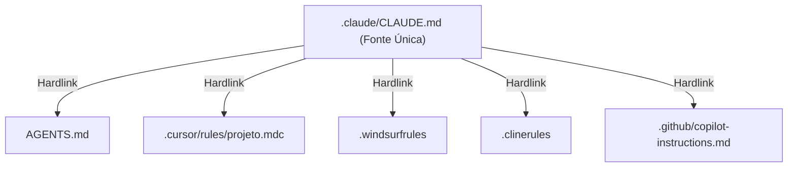

# 📖 O Livro da Fábrica Universal
## Guia Definitivo de Arquitetura Agêntica, Soberania Tecnológica e Engenharia com IA

> **Autor:** Fábrica Universal  
> **Público:** Desenvolvedores iniciantes, engenheiros seniores, arquitetos de software e gestores de tecnologia.  
> **Pré-requisitos:** Nenhum. Todos os conceitos são explicados do zero com analogias simples do dia a dia.

---

# 📑 Sumário

1. [Prefácio: Por Que a Fábrica Universal Existe?](#prefácio-por-que-a-fábrica-universal-existe)
2. [O Dicionário do Iniciante (Glossário Descomplicado)](#o-dicionário-do-iniciante-glossário-descomplicado)
3. [Capítulo 1: O Motor de Economia Severa de Tokens](#capítulo-1-o-motor-de-economia-severa-de-tokens)
   - 1.1 O Que São Tokens e Por Que Eles Custam Tão Caro?
   - 1.2 Técnica 1: *Caveman Thinking* (Pensamento Telegráfico)
   - 1.3 Técnica 2: *Headroom* (Compressão Inteligente de Logs)
   - 1.4 Técnica 3: *Lean-CTX* (Leitura Cirúrgica de Código)
   - 1.5 Técnica 4: *RTK-Memory* (Memória Estável e Aproveitamento de Cache)
   - 1.6 Técnica 5: *Pre-Flight Check* (A Lista de Verificação Pré-Voo)
4. [Capítulo 2: As 18 Leis Sagradas da Governança (R1 a R18)](#capítulo-2-as-18-leis-sagradas-da-governança-r1-a-r18)
5. [Capítulo 3: A Usina de Scripts Determinísticos (`scripts/`)](#capítulo-3-a-usina-de-scripts-determinísticos-scripts)
6. [Capítulo 4: Configurações & A Mágica da Portabilidade Multi-IDE](#capítulo-4-configurações--a-mágica-da-portabilidade-multi-ide)
7. [Capítulo 5: O Padrão Visual Diamante & Dossiê Executivo (Regra R5)](#capítulo-5-o-padrão-visual-diamante--dossiê-executivo-regra-r5)
8. [Capítulo 6: Manual Prático de Implementação (Projetos Novos & Existentes)](#capítulo-6-manual-prático-de-implementação-projetos-novos--existentes)

---

# Prefácio: Por Que a Fábrica Universal Existe?

Imagine que você contratou um assistente muito inteligente para ajudá-lo a construir uma casa. Porém, esse assistente tem três manias perigosas:
1. **Ele cobra por cada palavra que lê e por cada palavra que pensa**, mesmo quando pensa em silêncio. Se ele pensar enrolado, sua conta bancária é esvaziada em minutos.
2. **Ele é esquecido.** Conforme o dia passa e a conversa fica longa, ele começa a esquecer o que combinou no início da manhã.
3. **Ele sofre de excesso de confiança (alucinação).** Às vezes, ele afirma com certeza absoluta que colocou a viga no lugar certo, mas na verdade a viga nem existe.

A **Fábrica Universal** nasceu para resolver exatamente esses três problemas no desenvolvimento de software com Inteligência Artificial (chamado de **AIDD** ou *AI-Driven Development*).

Em vez de deixar a inteligência artificial agir sem limites, a Fábrica Universal cria uma **esteira industrial com trilhos de aço**. Ela ensina a IA a pensar de forma telegráfica e econômica, obriga a IA a validar tudo o que faz através de testes mecânicos no computador (que dão certo ou errado, sem meio-termo) e garante que o projeto nunca acumule lixo ou bagunça.

---

# O Dicionário do Iniciante (Glossário Descomplicado)

Para que qualquer pessoa — seja um estudante de primeiro dia ou um executivo de negócios — possa compreender este livro, aqui estão as definições simples de todos os termos técnicos usados no projeto:

* **IA / LLM (Large Language Model):** É o motor de inteligência artificial (como Claude, GPT-4, Gemini). Pense nele como um processador de texto ultrarrápido que tenta adivinhar a próxima palavra mais lógica.
* **Token:** É o "combustível" e a moeda de cobrança da IA. Um token é aproximadamente um pedaço de 4 letras de uma palavra. Quando você envia uma mensagem para a IA, você paga pelos tokens que enviou (entrada) e pelos tokens que ela respondeu (saída).
* **Contexto (Context Window):** É a "memória de curto prazo" da IA. É tudo o que ela consegue enxergar de uma vez só durante a conversa. Se o contexto ficar muito cheio, a IA fica lenta, cara e esquecida.
* **CoT (Chain of Thought / Pensamento Interno):** É o rascunho mental onde a IA raciocina antes de dar a resposta final.
* **Prompt:** A instrução ou comando que você dá para a IA.
* **Skill (Habilidade):** Uma pasta de instruções e regras especializadas que ensina a IA a executar uma tarefa específica com perfeição (por exemplo: fazer design, auditar código ou comprimir logs).
* **Git:** Um sistema de versionamento que funciona como uma "máquina do tempo" para o seu código. Ele salva fotografias do projeto a cada alteração.
* **Commit:** O ato de salvar uma "fotografia" definitiva do projeto no Git com uma mensagem explicando o que mudou.
* **Hook do Git (Pre-Commit Hook):** Um "guarda-costas" digital. É um pequeno script que roda automaticamente no seu computador toda vez que você tenta fazer um commit. Se o código estiver com defeito, com segredos expostos ou desorganizado, o guarda-costas **bloqueia o salvamento na hora**.
* **Exit Code (Código de Saída 0 ou 1):** A linguagem binária dos computadores. `Exit 0` significa "Sucesso total / Aprovado". `Exit 1` (ou qualquer número diferente de zero) significa "Erro / Reprovado".
* **Submodule:** Uma pasta dentro do seu projeto que aponta para outro repositório Git independente. Permite reutilizar toda a infraestrutura da Fábrica Universal sem duplicar arquivos.
* **Hardlink e Symlink (Junction):** São "portais mágicos" no sistema de arquivos do computador. Permitem que um mesmo arquivo exista fisicamente em apenas um lugar, mas apareça em várias pastas diferentes ao mesmo tempo.
* **IDE (Integrated Development Environment):** O programa que você usa para escrever código (ex: VS Code, Cursor, Windsurf, Claude Code).
* **Paridade de Espelho (Mirror Parity):** Garantir que duas pastas com o mesmo propósito (como `output/` e `docs/`) tenham exatamente o mesmo conteúdo e o mesmo código de verificação (*hash MD5*).

---

# Capítulo 1: O Motor de Economia Severa de Tokens

## 1.1 O Que São Tokens e Por Que Eles Custam Tão Caro?

Toda vez que você conversa com uma IA em um projeto de código, ela não lê apenas a sua última pergunta. Ela lê **todo o histórico da conversa, as regras do projeto e os arquivos que você pediu para analisar**.

Se um projeto tiver 100.000 tokens e a IA gastar mais 5.000 tokens para pensar e responder, uma única pergunta pode custar R$ 1,50 a R$ 5,00. Se você fizer 100 perguntas em um dia de trabalho, gastará centenas de reais apenas em conversas repetitivas.

Para resolver isso, a Fábrica Universal possui **5 Técnicas de Economia Severa**:

---

## 1.2 Técnica 1: *Caveman Thinking* (Pensamento de Homem das Cavernas)

* **O Que É:** Uma instrução de sistema que proíbe a IA de pensar usando linguagem rebuscada, artigos e preposições longas no seu rascunho mental (`<thought>`).
* **Como Funciona na Prática:**
  * ❌ **Pensamento Tradicional (Gasto: ~250 tokens):**  
    *"O usuário gostaria que eu analisasse o arquivo de configuração e verificasse se existem erros na linha quarenta e dois. Vou proceder com a leitura do arquivo, verificar os parâmetros e em seguida propor uma solução amigável..."*
  * ✅ **Pensamento Caveman (Gasto: ~25 tokens - Economia de 90%):**  
    *"usr quer ver config. linha 42. ler 10 linhas. achar bug. corrigir."*
* **Impacto Real:** A resposta final para o usuário continua em português impecável e polido, mas o "custo de processamento interno" cai em até 90%.

---

## 1.3 Técnica 2: *Headroom* (Compressão Inteligente de Logs de Terminal)

* **O Que É:** Quando você roda um comando ou compilação no terminal, o computador pode gerar 500 linhas de texto ("Compilando módulo 1... Compilando módulo 2...").
* **A Regra Headroom:** Se o log tiver mais de 7 linhas, a Fábrica corta o meio inútil e entrega para a IA apenas:
  * As **3 primeiras linhas** (para saber como o comando começou);
  * As **4 últimas linhas** (onde estão o erro ou o sucesso real).
* **Impacto Real:** Evita que 95% do contexto da IA seja entupido com textos repetitivos de compilação.

---

## 1.4 Técnica 3: *Lean-CTX* (Leitura Cirúrgica de Código)

* **O Que É:** Proibição da leitura indiscriminada de arquivos inteiros.
* **A Regra:** Nunca mande a IA ler um arquivo de 2.000 linhas se ela só precisa editar a linha 150.
* **Como Funciona:** O agente usa primeiro o comando de busca rápida (`grep_search`) para localizar exatamente a palavra-chave e lê apenas um bloco de 20 a 40 linhas ao redor do alvo.

---

## 1.5 Técnica 4: *RTK-Memory* (Memória Estável e Aproveitamento de Cache)

* **O Que É:** Os provedores modernos de IA (como Anthropic e OpenAI) oferecem descontos de até 90% no preço dos tokens se o início da conversa for **100% idêntico** ao das mensagens anteriores (recurso chamado de *Prompt Caching*).
* **Como Funciona:**
  * O arquivo principal de regras (`CLAUDE.md`) nunca muda durante a sessão de trabalho.
  * Todo aprendizado ou anotação temporária da IA é gravado em um arquivo externo separado (`RTK-SCRATCHPAD.md`).
  * Isso mantém o "prefixo" congelado, garantindo o desconto máximo de cache em todas as mensagens.

---

## 1.6 Técnica 5: *Pre-Flight Check* (Checagem Pré-Voo)

* **O Que É:** Antes de iniciar qualquer grande refatoração de código, a IA roda um checklist mental rápido de 3 itens:
  1. *Eu sei onde estão os arquivos exatos?*
  2. *Os testes atuais estão passando?*
  3. *Eu tenho uma forma mecânica de testar o resultado sem adivinhar?*
* Se a resposta for "Não" para qualquer item, ela para e investiga antes de alterar qualquer linha de código.

---

# Capítulo 2: As 18 Leis Sagradas da Governança (R1 a R18)

As regras da Fábrica Universal são numeradas de **R1 a R18**. Elas são inegociáveis e garantem a harmonia do ecossistema:

| Regra | Nome | O Que Significa na Prática |
| :--- | :--- | :--- |
| **R1** | **Idioma Único (PT-BR)** | Todo o pensamento, documentação, comentários de código e conversas devem ser estritamente em Português do Brasil. |
| **R2** | **Silenciamento de Prosa** | Sem introduções vazias como "Com certeza!", "Olá!", "Aqui está seu código". Markdown direto ao ponto. |
| **R3** | **Autonomia Operacional** | Uma vez que o operador aprova o plano, o agente trabalha de forma 100% autônoma até o final. |
| **R4** | **Auto-Correção Interna** | Se um teste falhar durante a execução, a IA deve corrigir o erro internamente antes de entregar ao usuário. |
| **R5** | **Padrão Diamante / Dossiê Executivo** | Todo documento visual HTML deve ter: Título/Deck justificados, Hero Stats Bar, Tabela fluida, 4 seções verticais nos cards e 3 passos práticos em mini-cards visuais. Proibido usar 2 colunas espremidas (`div.cols`). |
| **R6** | **Modelo Livre** | O projeto não fica amarrado a uma IA específica (`model: inherit`). Você pode usar qualquer modelo moderno. |
| **R7** | **Conteúdo de Entrega Intocável** | Relatórios, catálogos e textos finais que vão para o cliente nunca são resumidos ou truncados. |
| **R8** | **Determinismo Primeiro** | Se uma tarefa pode ser resolvida por um script de computador (contar, converter, formatar), **não gaste IA**. Deixe para a IA apenas o raciocínio complexo. |
| **R9** | **Gates Mecânicos** | Nenhuma regra de qualidade fica em promessas de texto. Tudo vira script Python com `exit 0` (aprovado) ou `exit 1` (bloqueado). |
| **R10** | **Idempotência** | Um script deve poder rodar 100 vezes seguidas e produzir sempre o mesmo resultado sem quebrar o estado do sistema. |
| **R11** | **Estado em Disco** | O estado do projeto vive salvo em arquivos reais (JSON/SQLite), nunca apenas na memória volátil da conversa. |
| **R12** | **Registro Declarativo Único** | Para adicionar um novo tipo de documento ou camada, edita-se apenas **1 linha** em `scripts/tipos.py`. |
| **R13** | **Padronização Numérica e Slugs Limpos** | Todos os compêndios e camadas seguem numeração contínua (`01` a `50`) com slugs descritivos em minúsculas e hífens. |
| **R14** | **Caminhos Curtos** | Nomes de arquivos respeitam o limite de 260 caracteres do Windows (MAX_PATH). |
| **R15** | **Segurança contra Vazamento de Segredos** | O Git bloqueia qualquer commit que contenha chaves de API, senhas ou certificados privados. |
| **R16** | **Nunca Commitar Código Vermelho** | O Git proíbe o commit se a suíte de testes automatizados estiver falhando. Corrija a causa antes de salvar. |
| **R17** | **Integridade de Repositórios & Validação de URLs** | Toda ferramenta catalogada DEVE possuir licença OSI explícita, identificação do SaaS substituído e URL de repositório válida. |
| **R18** | **Higiene Contínua & Sincronização Estrita** | **Zero entulho:** Proibido deixar arquivos temporários (`temp_*`, `fix_*`, `.bak`). **Paridade de Espelho:** `output/` e `docs/` devem ter os mesmos arquivos e mesmos hashes MD5. |

---

# Capítulo 3: A Usina de Scripts Determinísticos (`scripts/`)

A pasta `scripts/` é o coração mecânico da Fábrica. Aqui vivem os "operários digitais" que não alucinam:

### 1. `scripts/hooks/pre-commit` (O Guardião do Git)
* **O Que Faz:** É o script acionado automaticamente pelo Git antes de qualquer gravação.
* **Os 6 Gates de Inspeção:**
  1. *Gate 1:* Procura chaves de API e senhas no código (*R15*).
  2. *Gate 2:* Executa a suíte de testes Python (*pytest*) (*R16*).
  3. *Gate 3:* Executa os testes Node.js (*npm test*).
  4. *Gate 4:* Compila os arquivos Python para verificar se há erros de digitação/sintaxe.
  5. *Gate 5:* Atualiza o grafo de dependências do código (*code-review-graph*).
  6. *Gate 6:* Executa o auditor de higiene e paridade de espelhos (*R18*).
* Se qualquer um falhar, o commit é cancelado com `exit 1`.

### 2. `scripts/auditar_higiene_repo.py` (O Auditor R18)
* **O Que Faz:** Calcula o hash criptográfico (MD5) de todos os arquivos de `output/listas-open-source/` e compara com `docs/listas/`.
* Se houver 1 byte de diferença entre as pastas ou se encontrar scripts como `temp_teste.py`, ele avisa o desenvolvedor e reprova o build.

### 3. `scripts/limpar_entulho.py` (O Saneador Automático)
* **O Que Faz:** É a ferramenta de "faxina em 1 clique".
* Remove pastas temporárias, deleta arquivos `.bak` e espelha automaticamente todas as alterações de `output/` para `docs/`, garantindo 100% de conformidade com a regra R18.

### 4. `scripts/auditar_r5_dossie.py` (O Fiscal do Design Diamante)
* **O Que Faz:** Lê todas as 49 listas HTML e valida se todas contêm o Hero Stats Bar, a busca interativa, a tabela fluida e as 4 seções verticais com os 3 passos práticos em mini-cards.

### 5. `scripts/setup-links.ps1` (Windows) e `setup-links.sh` (Linux/Mac)
* **O Que Faz:** Cria os links simbólicos e copia os hooks do Git após clonar o repositório.

---

# Capítulo 4: Configurações & A Mágica da Portabilidade Multi-IDE

Um dos maiores problemas do desenvolvimento moderno com IA é a fragmentação de ferramentas:
* O Claude Code lê `.claude/CLAUDE.md`;
* O Cursor lê `.cursor/rules/`;
* O Windsurf lê `.windsurfrules`;
* O Cline lê `.clinerules`;
* O GitHub Copilot lê `.github/copilot-instructions.md`.

### Como a Fábrica Universal Resolve Isso Sem Duplicar Arquivos:

Em vez de você ter que copiar e colar as regras em 5 arquivos diferentes toda vez que mudar uma linha, a Fábrica estabelece **UMA ÚNICA FONTE DA VERDADE**: a pasta `.claude/CLAUDE.md`.

Ao rodar o script `setup-links`, o sistema operacional cria **Hardlinks** (links diretos no disco) apontando para o mesmo arquivo físico.



> **Resultado:** Você edita apenas `.claude/CLAUDE.md` e todas as IDEs do planeta são atualizadas instantaneamente no mesmo milissegundo.

---

# Capítulo 5: O Padrão Visual Diamante & Dossiê Executivo (Regra R5)

A regra **R5** define que qualquer artefato entregue para o usuário final deve ter o nível estético de uma publicação editorial de prestígio (como a revista *The Economist* ou relatórios da *McKinsey*).

### A Estrutura de 4 Seções de um Card Diamante (`div.entry`):

1. **Cabeçalho & Badges:** Número da ferramenta, nome limpo, nível de senioridade necessário (Júnior/Pleno/Sênior), produto SaaS substituído, economia anual e licença OSI.
2. **Seção 1 (O Que Faz & Como Funciona):** Explicação clara em linguagem simples + bloco de código executável (`docker run` ou `pip install`) com botão "Copiar" interativo.
3. **Seção 2 (Análise Econômica & ROI):** Dois cartões de destaque com os softwares pagos que são eliminados e o valor total economizado por ano.
4. **Seção 3 (Requisitos de Infraestrutura & Veredito):** Consumo real de memória RAM e processador em repouso, padrões de mercado e o veredito do arquiteto explicando por que adotar a tecnologia.
5. **Seção 4 (Como Usar no Dia a Dia):** Grid visual com **3 mini-cards práticos numerados**:
   * `[1] Configuração` (Como instalar e configurar variáveis);
   * `[2] Operação` (Como usar no dia a dia da empresa);
   * `[3] Resultado` (O benefício prático entregue).

---

# Capítulo 6: Manual Prático de Implementação (Projetos Novos & Existentes)

## 📦 Caso A: Criando um Projeto Novo com a Fábrica Universal (5 Minutos)

Se você vai iniciar um sistema novo do zero:

1. **Crie a pasta do projeto e inicie o Git:**
   ```bash
   mkdir meu-projeto-incrivel && cd meu-projeto-incrivel
   git init
   ```

2. **Adicione a Fábrica Universal como Submódulo:**
   ```bash
   git submodule add https://github.com/Heverton-web/fabrica-universal.git fabrica-universal
   git submodule update --init --recursive
   ```

3. **Copie os arquivos de governança e scripts:**
   ```bash
   cp -r fabrica-universal/.claude .
   mkdir -p scripts && cp -r fabrica-universal/scripts/* scripts/
   ```

4. **Execute o script de conexão:**
   * No Windows:
     ```powershell
     .\scripts\setup-links.ps1 meu-projeto-incrivel
     ```
   * No Linux / Mac:
     ```bash
     bash scripts/setup-links.sh meu-projeto-incrivel
     ```

5. **Personalize o arquivo `.claude/CLAUDE.md`:**
   * Troque `<SEU-PROJETO>` pelo nome do seu sistema.
   * Preencha as seções marcadas com `[CUSTOMIZAR]`.
   * **Mantenha intactas** a Seção 0 de Economia e as Regras R1 a R18.

---

## 🔧 Caso B: Blindando um Projeto Que Já Existe (Brownfield)

Se você já tem um projeto pronto com milhares de linhas de código e quer aplicar a governança da Fábrica Universal:

1. **Adicione o submódulo da Fábrica:**
   ```bash
   git submodule add https://github.com/Heverton-web/fabrica-universal.git fabrica-universal
   ```

2. **Copie as 5 Skills de Economia de Tokens:**
   ```bash
   mkdir -p .claude/skills
   cp -r fabrica-universal/.claude/skills/* .claude/skills/
   ```

3. **Adicione a Usina de Gates:**
   ```bash
   mkdir -p scripts/hooks
   cp fabrica-universal/scripts/hooks/pre-commit scripts/hooks/
   cp fabrica-universal/scripts/auditar_higiene_repo.py scripts/
   cp fabrica-universal/scripts/limpar_entulho.py scripts/
   ```

4. **Ative o Hook do Git:**
   * Copie `scripts/hooks/pre-commit` para dentro de `.git/hooks/pre-commit`.

5. **Valide a Higiene:**
   ```bash
   python scripts/limpar_entulho.py
   ```
   * O script rodará a auto-limpeza e emitirá o certificado de aprovação verde do Gate R18.

---

# 🏁 Conclusão

A **Fábrica Universal** não é apenas um conjunto de regras: é um **sistema operacional de engenharia de software para a era da inteligência artificial**.

Ao unir **economia telegráfica de tokens**, **gates determinísticos que impedem erros humanos** e **portabilidade universal para qualquer IDE**, você constrói softwares de nível corporativo com custo próximo de zero, velocidade máxima e soberania tecnológica permanente.

---
*Fim do Livro da Fábrica Universal · Versão 2.0 (Padrão Diamante).*
