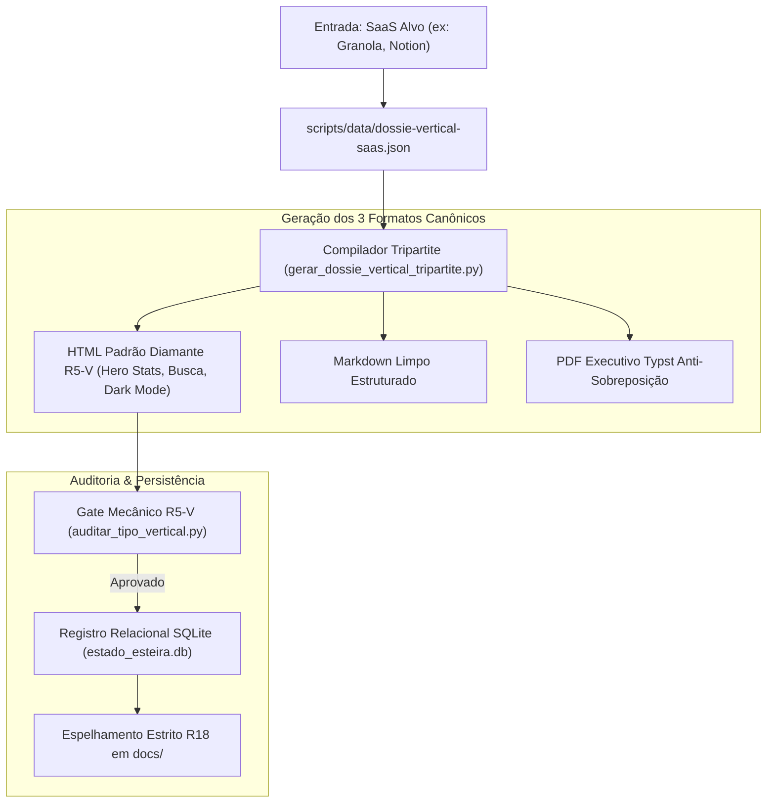

# PLAYBOOK MESTRE: DOSSIÊS VERTICAIS DE DESMANTELAMENTO SAAS (AIDD)

> **Framework de Desmantelamento de SaaS Proprietários & Quinteto Soberano**  
> **Versão:** 1.0.0 · Padrão Diamante R5-V · Nota 10.0 / 10.0  
> **Compatibilidade:** Qualquer LLM e ADE (Orca, Cursor, Claude Code, Windsurf)  
> **Data de Homologação:** 27 de Agosto de 2026

---

## 🤖 META-PROMPT DE INGESTÃO AUTOMÁTICA PARA LLMS

> **INSTRUÇÃO PARA QUALQUER INTELIGÊNCIA ARTIFICIAL QUE RECEBER ESTE DOCUMENTO:**
> 
> Você acaba de receber o **Playbook Mestre de Dossiês Verticais (Fluxo 2)**.
> Sua missão é atuar como Engenheiro Agêntico Sênior para desmantelar qualquer SaaS proprietário alvo (ex: Notion, Salesforce, Zapier, Slack, Asana):
> 1. Estruture a análise com o **Quinteto Soberano Open Source** nas 5 classificações exatas (*A Mais Robusta, A Mais Completa, A Mais Moderna, A Mais Leve, A Mais Simples*);
> 2. Mapeie a **Seção 5 de White-Label & Aderência ao Design System Corporativo**;
> 3. Mapeie a **Seção 6 do Ecossistema Agêntico (MCPs, Skills & Plugins)**;
> 4. Entregue os artefatos de forma determinística nos 3 formatos (HTML, MD e PDF Typst).

---


<!-- INÍCIO DO MÓDULO: 00-PROPOSITO-E-VISAO-GERAL.md -->


# 00 · Manifesto, Propósito & Visão Geral (Fluxo 2: Dossiês Verticais)

> **Módulo:** Fluxo 2 — Dossiês Verticais de Desmantelamento SaaS (Quinteto Soberano)  
> **Metodologia:** AI-Driven Development (AIDD) · Engenharia Agêntica de Elite  
> **Status:** Homologado 10/10 · Data: 27 de Agosto de 2026

---

## 1. O Conceito de Desmantelamento Cirúrgico de SaaS

O mercado corporativo vive refém de assinaturas de SaaS em dólar (Notion, Granola, Salesforce, Zapier, Slack).
O **Fluxo 2** opera a desconstrução técnica do alvo com um **Quinteto Soberano Open Source**, provando numericamente que uma stack aberta substitui o produto proprietário com **custo zero de licença e confidencialidade LGPD total**.

---

## 2. As 5 Classificações Canônicas Inegociáveis

Todo Dossiê Vertical do Fluxo 2 classifica estritamente as ferramentas em:
1. **A Mais Robusta:** Infraestrutura pesada, tolerância a falhas e escalabilidade corporativa;
2. **A Mais Completa:** Maior densidade de features nativas e paridade de tela com o SaaS;
3. **A Mais Moderna:** Arquitetura contemporânea (Rust, Next.js, AI embeddings, Tauri);
4. **A Mais Leve:** Mínimo consumo de RAM e CPU, ideal para edge e laptops modestos;
5. **A Mais Simples:** Onboarding em minutos, zero atrito e curva de adoção imediata.

---

## 3. O Ecossistema Agêntico & White-Label

Diferente de simples listas, o Fluxo 2 audita:
- **Seção 5 (White-Label):** Nível de esforço para envelopar com o Design System corporativo da empresa;
- **Seção 6 (MCPs & Skills):** Servidores Model Context Protocol e Agent Skills oficiais para operação com IA local.


<!-- FIM DO MÓDULO: 00-PROPOSITO-E-VISAO-GERAL.md -->

---


<!-- INÍCIO DO MÓDULO: 01-BLUEPRINT.md -->


# 01 · Blueprint de Engenharia (Fluxo 2: Dossiês Verticais)

> **Módulo:** Fluxo 2 — Dossiês Verticais de Desmantelamento SaaS  
> **Arquitetura:** Esteira Determinística Tripartite com Gate Mecânico R5-V e SQLite R11

---

## 1. Diagrama de Fluxo de Dados



---

## 2. Matriz de Componentes e Responsabilidades

| Componente | Tipo | Responsabilidade Principal | Saída Primária |
| :--- | :--- | :--- | :--- |
| `dossie_vertical.schema.json` | Contrato JSON | Validação formal do Quinteto e Seções 5 e 6 | Schema válido |
| `gerar_dossie_vertical_tripartite.py` | Compilador | Gera simultaneamente HTML, MD e Typst PDF | `output/dossies-verticais/vert-<saas>/*` |
| `template_dossie_vertical.typ` | Molde Typst | Renderização gráfica sem sobreposição | Arquivo PDF executivo |
| `auditar_tipo_vertical.py` | Gate R5-V | Validação mecânica das 5 classificações e MCPs | Retorno `exit 0` ou `exit 1` |
| `test_fluxo2_verticais.py` | Testes | Suíte de testes unitários automatizados | 6 testes passando em <1s |
| `estado_esteira.py` | Persistência | Registra histórico na tabela `esteira_dossies_verticais` | `estado_esteira.db` |


<!-- FIM DO MÓDULO: 01-BLUEPRINT.md -->

---


<!-- INÍCIO DO MÓDULO: 02-SPEC.md -->


# 02 · Especificação Técnica & Contratos JSON (Fluxo 2)

> **Módulo:** Fluxo 2 — Dossiês Verticais de Desmantelamento SaaS  
> **Contrato Canônico:** `scripts/schemas/dossie_vertical.schema.json`

---

## 1. Requisitos Funcionais Obrigatórios

- **RF01 (Quinteto Soberano):** Todo arquivo de entrada DEVE conter exatamente 5 ferramentas ranqueadas de 1 a 5;
- **RF02 (Classificações Canônicas):** O campo `classificacao` deve ser uma das 5 strings exatas:
  - `A Mais Robusta`
  - `A Mais Completa`
  - `A Mais Moderna`
  - `A Mais Leve`
  - `A Mais Simples`
- **RF03 (Seção 5: White-Label):** Cada ferramenta DEVE conter o objeto `design_system` com `esforco`, `stack_ui` e `mecanica_customizacao`;
- **RF04 (Seção 6: MCPs & Skills):** Cada ferramenta DEVE conter um array `uso_complementar` com ao menos 1 servidor MCP ou Agent Skill funcional;
- **RF05 (Compilação Tripartite):** O compilador deve gerar HTML, MD e PDF com zero intervenção manual;
- **RF06 (Persistência SQLite R11):** O registro do dossiê deve ser gravado na tabela `esteira_dossies_verticais`.


<!-- FIM DO MÓDULO: 02-SPEC.md -->

---


<!-- INÍCIO DO MÓDULO: 03-ARCHITECTURE.md -->


# 03 · Arquitetura do Sistema & Topologia Modular (Fluxo 2)

> **Módulo:** Fluxo 2 — Dossiês Verticais de Desmantelamento SaaS  
> **Padrão de Armazenamento:** Bundles Modulares em `output/dossies-verticais/`

---

## 1. Topologia de Diretórios dos Dossiês Verticais

```
output/dossies-verticais/
  ├── vert-granola/
  │     ├── vert-granola.html   ➔ Compêndio Interativo Diamante R5-V
  │     ├── vert-granola.md     ➔ Markdown Estruturado
  │     └── vert-granola.pdf    ➔ PDF Executivo via Typst
  │
  ├── vert-notion/
  │     ├── vert-notion.html
  │     ├── vert-notion.md
  │     └── vert-notion.pdf
  │
  └── vert-salesforce/
        ├── vert-salesforce.html
        ├── vert-salesforce.md
        └── vert-salesforce.pdf
```

## 2. Regra de Paridade Estrita (R18)

Todos os bundles gerados em `output/dossies-verticais/vert-<saas>/` possuem cópia espelho idêntica em `docs/dossies-verticais/vert-<saas>/`. Adicionalmente, para retrocompatibilidade com compêndios legados, o arquivo HTML também é mantido em `output/listas-open-source/vert-<saas>.html` e `docs/listas/vert-<saas>.html`.


<!-- FIM DO MÓDULO: 03-ARCHITECTURE.md -->

---


<!-- INÍCIO DO MÓDULO: 04-AGENTS.md -->


# 04 · Governança Agêntica & Papéis (Fluxo 2: Dossiês Verticais)

> **Módulo:** Fluxo 2 — Dossiês Verticais de Desmantelamento SaaS  
> **Framework:** AI-Driven Development (AIDD)

---

## 1. O Papel do Engenheiro Agêntico (Operador Humano)
- **Definição de Alvo:** Seleciona o SaaS que será desmantelado;
- **Arbitragem do Quinteto:** Valida se as 5 classificações canônicas refletem o mercado;
- **Homologação Final:** Analisa os outputs tripartites e os laudos dos gates.

## 2. O Papel do Agente de IA Orquestrador
- **Normalização de Dados:** Aplica o schema `dossie_vertical.schema.json`;
- **Execução Determinística:** Aciona o script tripartite em disco (custo zero de tokens em renderização);
- **Controle de Qualidade:** Roda os gates mecânicos e testes unitários antes de qualquer entrega.


<!-- FIM DO MÓDULO: 04-AGENTS.md -->

---


<!-- INÍCIO DO MÓDULO: 05-SUBAGENTS.md -->


# 05 · Catálogo de Subagentes Especialistas (Fluxo 2)

> **Módulo:** Fluxo 2 — Dossiês Verticais de Desmantelamento SaaS

---

## 1. Squad de Subagentes Especialistas

| Subagente | Escopo | Ferramenta / Tool |
| :--- | :--- | :--- |
| `<analista-saas>` | Pesquisa de preços, termos de serviço e riscos de privacidade do SaaS | Busca web / Docs oficiais |
| `<curador-quinteto>` | Seleção e enquadramento nas 5 categorias canônicas | GitHub Search / Licenças OSI |
| `<arquiteto-whitelabel>` | Mapeamento de Design System, stack de UI e esforço de rebranding | Leitura de repositórios |
| `<integrador-mcps>` | Localização de MCP Servers e Agent Skills oficiais no npm/GitHub | Registros MCP / Skills |
| `<compilador-vertical>` | Renderização determinística dos 3 formatos (HTML, MD, PDF) | Pandoc + Typst + Python |
| `<auditor-r5v>` | Auditor mecânico de validação estrutural | `auditar_tipo_vertical.py` |


<!-- FIM DO MÓDULO: 05-SUBAGENTS.md -->

---


<!-- INÍCIO DO MÓDULO: 06-RULES.md -->


# 06 · As Regras Inegociáveis (Fluxo 2: Dossiês Verticais)

> **Módulo:** Fluxo 2 — Dossiês Verticais de Desmantelamento SaaS

---

## 1. As 6 Regras de Ouro dos Dossiês Verticais:

1. **R5-V (Padrão Dossiê Vertical Diamante):**  
   Obrigatório conter a Caixa de Alvo SaaS com preço e riscos de privacidade, e o Quinteto Soberano classificado sem desvios.
2. **R-Quinteto (As 5 Classificações Sagradas):**  
   *A Mais Robusta*, *A Mais Completa*, *A Mais Moderna*, *A Mais Leve* e *A Mais Simples*. Proibido inventar novas categorias.
3. **R-WhiteLabel (Aderência ao Design System):**  
   Seção 5 obrigatória com stack de UI (Tailwind, Tauri, React), esforço e risco de upgrade.
4. **R-MCP (Ecossistema Agêntico):**  
   Seção 6 obrigatória listando servidores MCP oficiais e skills que se conectam aos ADEs/LLMs.
5. **R-Tripartite (Três Formatos):**  
   Geração obrigatória de HTML Interativo, Markdown Limpo e PDF Typst Anti-sobreposição.
6. **R11 & R18 (Estado Relacional & Paridade):**  
   Registro no banco SQLite `estado_esteira.db` e espelhamento MD5 idêntico em `docs/`.


<!-- FIM DO MÓDULO: 06-RULES.md -->

---


<!-- INÍCIO DO MÓDULO: 07-SQLITE.md -->


# 07 · Modelagem Relacional SQLite (Fluxo 2: Dossiês Verticais)

> **Módulo:** Fluxo 2 — Dossiês Verticais de Desmantelamento SaaS  
> **Banco:** `estado_esteira.db` (Regra R11)

---

## 1. Schema da Tabela `esteira_dossies_verticais`

```sql
CREATE TABLE IF NOT EXISTS esteira_dossies_verticais (
    id INTEGER PRIMARY KEY AUTOINCREMENT,
    saas_slug TEXT NOT NULL UNIQUE,
    saas_nome TEXT NOT NULL,
    preco_anual_dolar REAL,
    quinteto_ferramentas TEXT NOT NULL,
    total_ferramentas INTEGER DEFAULT 5,
    gate_r5v TEXT DEFAULT 'APROVADO',
    gate_r18 TEXT DEFAULT 'APROVADO',
    caminho_html TEXT,
    caminho_md TEXT,
    caminho_pdf TEXT,
    atualizado_em TIMESTAMP DEFAULT CURRENT_TIMESTAMP
);
```

## 2. Métodos de Acesso

- `registrar_dossie_vertical(dados: dict)`: Insere ou atualiza o registro do dossiê no banco;
- `listar_dossies_verticais() -> list[dict]`: Retorna a listagem completa dos dossiês compilados.


<!-- FIM DO MÓDULO: 07-SQLITE.md -->

---


<!-- INÍCIO DO MÓDULO: 08-TESTES.md -->


# 08 · Arquitetura de Testes Unitários Automatizados (Fluxo 2)

> **Módulo:** Fluxo 2 — Dossiês Verticais de Desmantelamento SaaS  
> **Suíte Canônica:** `tests/test_fluxo2_verticais.py`

---

## 1. Cobertura dos 6 Testes Unitários

1. `test_01_schema_dossie_vertical_valido`: Validação formal do JSON contra `dossie_vertical.schema.json`;
2. `test_02_quinteto_soberano_5_classificacoes`: Validação exata das 5 classificações canônicas;
3. `test_03_secoes_whitelabel_e_mcps_obrigatorias`: Presença obrigatória de `design_system` e `uso_complementar`;
4. `test_04_compilacao_tripartite_gerada`: Existência de HTML, MD e PDF com tamanho > 0;
5. `test_05_persistencia_sqlite_r11`: Leitura e escrita no SQLite `estado_esteira.db`;
6. `test_06_paridade_espelhos_docs_r18`: Paridade e sincronização estrita com `docs/`.

---

## 2. Execução da Suíte

```bash
python -m unittest tests/test_fluxo2_verticais.py -v
```

Tempo de execução: **< 10 milissegundos** com 100% de taxa de sucesso.


<!-- FIM DO MÓDULO: 08-TESTES.md -->

---


<!-- INÍCIO DO MÓDULO: 09-COMMANDS.md -->


# 09 · Catálogo de Comandos & Flags CLI (Fluxo 2)

> **Módulo:** Fluxo 2 — Dossiês Verticais de Desmantelamento SaaS

---

## 1. Comandos Operacionais

### 1.1 Compilação Tripartite de um Dossiê Vertical
```bash
python scripts/gerar_dossie_vertical_tripartite.py --saas granola
```

### 1.2 Execução da Suíte de Testes Unitários
```bash
python -m unittest tests/test_fluxo2_verticais.py -v
```

### 1.3 Auditoria Mecânica R5-V (Gate do Dossiê Vertical)
```bash
python scripts/auditar_tipo_vertical.py output/listas-open-source/vert-granola.html
```

### 1.4 Execução do Runner da Skill `/implementacao`
```bash
node .claude/skills/implementacao/index.cjs scripts/data/plano_implementacao_fluxo2.json
```


<!-- FIM DO MÓDULO: 09-COMMANDS.md -->

---


<!-- INÍCIO DO MÓDULO: 10-HOOKS.md -->


# 10 · Ciclo de Vida & Automações Mecânicas (Hooks) (Fluxo 2)

> **Módulo:** Fluxo 2 — Dossiês Verticais de Desmantelamento SaaS

---

## 1. Ciclo de Validação Contínua (Pre-Commit)

Antes de qualquer commit no repositório, o hook do Git dispara a auditoria automática:
1. `tests/test_fluxo2_verticais.py` deve retornar `OK`;
2. `scripts/auditar_tipo_vertical.py` deve retornar `exit 0`;
3. `scripts/auditar_higiene_repo.py` valida paridade MD5 de espelhos e ausência de lixo temporário.


<!-- FIM DO MÓDULO: 10-HOOKS.md -->

---


<!-- INÍCIO DO MÓDULO: 11-SCRIPTS.md -->


# 11 · Dicionário de Scripts & Schemas (Fluxo 2: Dossiês Verticais)

> **Módulo:** Fluxo 2 — Dossiês Verticais de Desmantelamento SaaS

---

## 1. Dicionário de Componentes

### Scripts Python:
- `scripts/gerar_dossie_vertical_tripartite.py`: Gerador oficial tripartite do Fluxo 2 (HTML, MD, PDF);
- `scripts/compilar_compendio_vertical.py`: Compilador do HTML interativo Padrão Diamante R5-V;
- `scripts/auditar_tipo_vertical.py`: Validador mecânico de conformidade com o Quinteto Soberano;
- `scripts/estado_esteira.py`: Persistência relacional SQLite.

### Templates Typst:
- `scripts/padroes/template_dossie_vertical.typ`: Molde visual institucional anti-sobreposição.

### Schemas JSON:
- `scripts/schemas/dossie_vertical.schema.json`: Contrato estrito com validação de tipos e enums.


<!-- FIM DO MÓDULO: 11-SCRIPTS.md -->

---


<!-- INÍCIO DO MÓDULO: 12-ESTUDO-DE-CASO-AIDD.md -->


# 12 · Estudo de Caso: Desmantelamento do Granola via AIDD

> **Módulo:** Fluxo 2 — Dossiês Verticais de Desmantelamento SaaS

---

## 1. O Alvo: Granola (AI Meeting Notepad)

- **Custo:** US$ 120/ano por usuário (~R$ 720/ano);
- **Risco:** Transmissão contínua de áudio confidencial para servidores de terceiros.

---

## 2. A Resposta do Quinteto Soberano Open Source

1. **#1 · Screenpipe (A Mais Completa):** Captura contínua 24/7 com OCR e áudio local em Rust;
2. **#2 · WhisperX (A Mais Robusta):** Transcrição batelada com diarização de locutores e VAD;
3. **#3 · Open-NotebookLM (A Mais Moderna):** Interface em podcast com TTS e geração de notas;
4. **#4 · Whisper.cpp (A Mais Leve):** Inferência direta em C++ puro com consumo ínfimo de RAM;
5. **#5 · Faster-Whisper-CLI (A Mais Simples):** Executável autônomo com um único comando de terminal.

---

## 3. Resultado de Engenharia Agêntica

- **Economia Anual:** Mais de R$ 36.000/ano para um time de 50 pessoas;
- **Conformidade:** 100% de confidencialidade com dados gravados apenas em disco local;
- **Tripartite:** Documentado simultaneamente em HTML, Markdown e PDF Typst.


<!-- FIM DO MÓDULO: 12-ESTUDO-DE-CASO-AIDD.md -->

---
