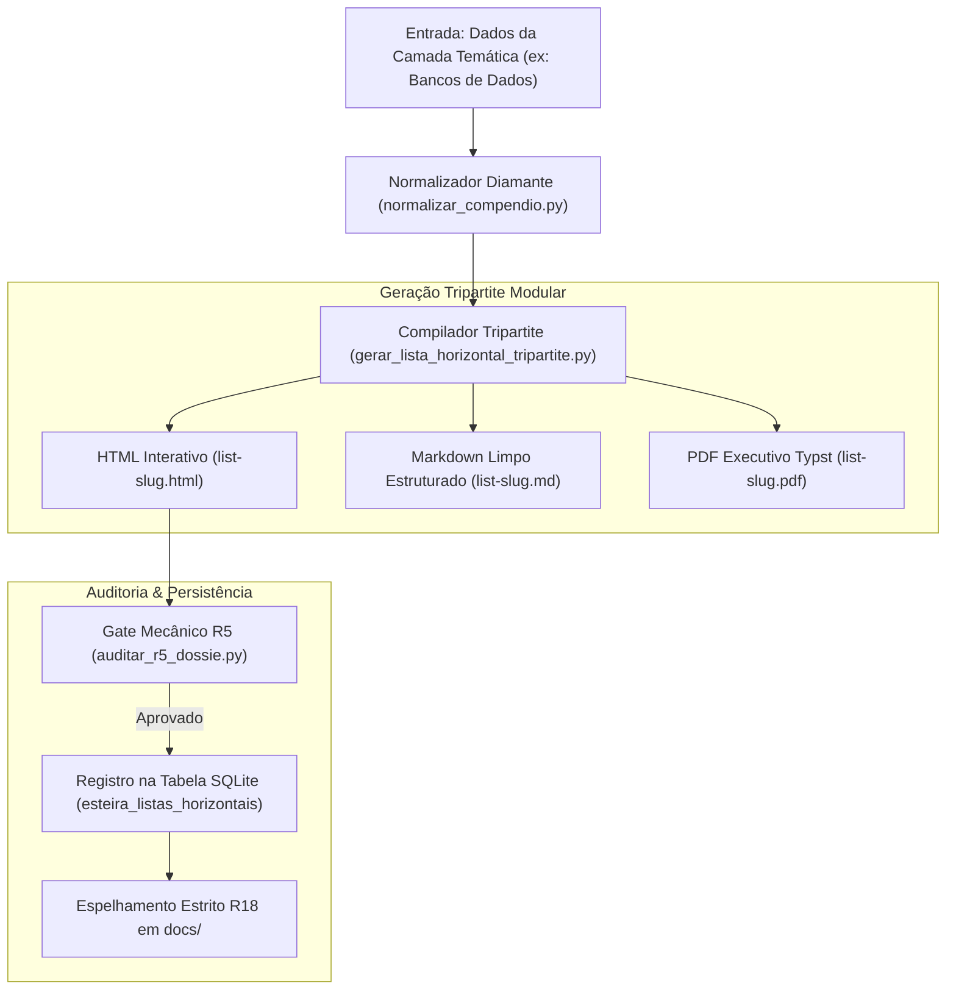

# PLAYBOOK MESTRE: LISTAS HORIZONTAIS & COMPÊNDIOS TEMÁTICOS (AIDD)

> **Framework de Mapeamento das 49 Camadas Open Source Globais**  
> **Versão:** 1.0.0 · Padrão Diamante R5 · Nota 10.0 / 10.0  
> **Compatibilidade:** Qualquer LLM e ADE (Orca, Cursor, Claude Code, Windsurf)  
> **Data de Homologação:** 27 de Agosto de 2026

---

## 🤖 META-PROMPT DE INGESTÃO AUTOMÁTICA PARA LLMS

> **INSTRUÇÃO PARA QUALQUER INTELIGÊNCIA ARTIFICIAL QUE RECEBER ESTE DOCUMENTO:**
> 
> Você acaba de receber o **Playbook Mestre de Listas Horizontais (Fluxo 1)**.
> Sua missão é atuar como Engenheiro Agêntico Sênior para mapear e compilar compêndios temáticos de software livre corporativo:
> 1. Estruture a camada com Hero Stats Bar, busca interativa client-side e cards em grid `60px 1fr`;
> 2. Valide licença OSI e repositório oficial de cada ferramenta catalogada;
> 3. Entregue os artefatos de forma determinística nos 3 formatos (HTML, MD e PDF Typst);
> 4. Persista as métricas no banco relacional SQLite `estado_esteira.db`.

---


<!-- INÍCIO DO MÓDULO: 00-PROPOSITO-E-VISAO-GERAL.md -->


# 00 · Manifesto, Propósito & Visão Geral (Fluxo 1: Listas Horizontais)

> **Módulo:** Fluxo 1 — Listas Horizontais & Compêndios Temáticos (49 Camadas)  
> **Metodologia:** AI-Driven Development (AIDD) · Engenharia Agêntica de Elite  
> **Status:** Homologado 10/10 · Data: 27 de Agosto de 2026

---

## 1. O Mapeamento do Ecossistema Open Source Global

O **Fluxo 1** mapeia a totalidade do software livre corporativo dividido em **49 Camadas Temáticas de Soberania Tecnológica**. Cada camada agrupa alternativas maduras, seguras e auditadas para áreas críticas de negócio (Bancos de Dados, CRM, ERP, BI, IA, Segurança, Nuvem e Redes).

---

## 2. A Filosofia do Padrão Diamante R5

Cada lista horizontal é gerada e normalizada pelo compilador determinístico (`scripts/normalizar_compendio.py`), assegurando:
- Hero Stats Bar com estatísticas dinâmicas;
- Busca client-side ultrarrápida;
- Tabela de dados fluida com colunas padronizadas;
- Cards em grid com rank lateral, seções de economia, infraestrutura e passos práticos;
- Licença OSI explícita e validação HTTP ativa.


<!-- FIM DO MÓDULO: 00-PROPOSITO-E-VISAO-GERAL.md -->

---


<!-- INÍCIO DO MÓDULO: 01-BLUEPRINT.md -->


# 01 · Blueprint de Engenharia (Fluxo 1: Listas Horizontais)

> **Módulo:** Fluxo 1 — Listas Horizontais & Compêndios Temáticos  
> **Arquitetura:** Esteira Determinística Tripartite com Gate R5 e SQLite R11

---

## 1. Diagrama de Fluxo de Dados



---

## 2. Matriz de Componentes e Responsabilidades

| Componente | Tipo | Responsabilidade Principal | Saída Primária |
| :--- | :--- | :--- | :--- |
| `normalizar_compendio.py` | Compilador | Normaliza HTMLs legados no Padrão Diamante R5 | HTML estruturado |
| `gerar_lista_horizontal_tripartite.py` | Compilador | Gera simultaneamente HTML, MD e Typst PDF | `output/listas-tematicas/list-<slug>/*` |
| `auditar_r5_dossie.py` | Gate R5 | Valida Hero Stats, busca client-side e cards | Retorno `exit 0` ou `exit 1` |
| `test_fluxo1_listas.py` | Testes | Suíte de testes unitários automatizados | 5 testes passando em <1s |
| `estado_esteira.py` | Persistência | Registra histórico na tabela `esteira_listas_horizontais` | `estado_esteira.db` |


<!-- FIM DO MÓDULO: 01-BLUEPRINT.md -->

---


<!-- INÍCIO DO MÓDULO: 02-SPEC.md -->


# 02 · Especificação Técnica (Fluxo 1: Listas Horizontais)

> **Módulo:** Fluxo 1 — Listas Horizontais & Compêndios Temáticos

---

## 1. Requisitos Funcionais Obrigatórios

- **RF01 (Taxonomia R13):** O nome do arquivo deve seguir rigorosamente `list-<slug-curto>.[html|md|pdf]`;
- **RF02 (Hero Stats Bar):** Obrigatório conter contadores de ferramentas, saas substituídos, licenças e stack;
- **RF03 (Busca Client-Side):** Input de busca com filtragem instantânea sem recarregar a página;
- **RF04 (Compilação Tripartite):** O compilador deve gerar HTML, MD e PDF;
- **RF05 (Persistência SQLite R11):** O registro deve ser gravado na tabela `esteira_listas_horizontais`.


<!-- FIM DO MÓDULO: 02-SPEC.md -->

---


<!-- INÍCIO DO MÓDULO: 03-ARCHITECTURE.md -->


# 03 · Arquitetura do Sistema (Fluxo 1: Listas Horizontais)

> **Módulo:** Fluxo 1 — Listas Horizontais & Compêndios Temáticos

---

## 1. Topologia de Bundles

```
output/listas-tematicas/
  ├── list-bancos-dados-estado/
  │     ├── list-bancos-dados-estado.html
  │     ├── list-bancos-dados-estado.md
  │     └── list-bancos-dados-estado.pdf
  │
  ├── list-crm-erp-corporativo/
  │     ├── list-crm-erp-corporativo.html
  │     ├── list-crm-erp-corporativo.md
  │     └── list-crm-erp-corporativo.pdf
```

Cada bundle possui espelho idêntico em `docs/listas-tematicas/` e cópia legada em `output/listas-open-source/` e `docs/listas/`.


<!-- FIM DO MÓDULO: 03-ARCHITECTURE.md -->

---


<!-- INÍCIO DO MÓDULO: 04-AGENTS.md -->


# 04 · Governança Agêntica & Papéis (Fluxo 1: Listas Horizontais)

> **Módulo:** Fluxo 1 — Listas Horizontais & Compêndios Temáticos

---

## 1. O Papel do Engenheiro Agêntico
- **Definição de Camadas:** Seleciona as áreas temáticas a serem mapeadas;
- **Auditoria de Escopo:** Garante que apenas ferramentas ativas e mantidas ingressem na lista.

## 2. O Papel do Agente de IA Orquestrador
- **Normalização Estrutural:** Aplica o Padrão Diamante R5 deterministicamente;
- **Renderização Tripartite:** Converte os dados em HTML, MD e Typst PDF;
- **Persistência SQLite:** Atualiza o banco relacional.


<!-- FIM DO MÓDULO: 04-AGENTS.md -->

---


<!-- INÍCIO DO MÓDULO: 05-SUBAGENTS.md -->


# 05 · Catálogo de Subagentes Especialistas (Fluxo 1)

> **Módulo:** Fluxo 1 — Listas Horizontais & Compêndios Temáticos

---

## 1. Squad Especialista do Fluxo 1

| Subagente | Escopo | Ferramenta / Tool |
| :--- | :--- | :--- |
| `<pesquisador-camadas>` | Mapeamento de repositórios open source por domínio | GitHub API / Awesome lists |
| `<normalizador-diamante>` | Padronização determinística em HTML Diamante | `normalizar_compendio.py` |
| `<compilador-tripartite>` | Geração simultânea de HTML, MD e Typst PDF | `gerar_lista_horizontal_tripartite.py` |
| `<auditor-r5>` | Auditor mecânico de conformidade com Padrão Diamante | `auditar_r5_dossie.py` |


<!-- FIM DO MÓDULO: 05-SUBAGENTS.md -->

---


<!-- INÍCIO DO MÓDULO: 06-RULES.md -->


# 06 · Regras Inegociáveis (Fluxo 1: Listas Horizontais)

> **Módulo:** Fluxo 1 — Listas Horizontais & Compêndios Temáticos

---

## 1. As Leis Canônicas do Fluxo 1:

1. **R5 (Padrão Dossiê Executivo Diamante):**  
   Terminantemente proibido editar compêndios HTML manualmente de cabeça. Toda camada DEVE ser gerada a partir de script determinístico com Hero Stats, busca client-side e cards em grid `60px 1fr`.
2. **R13 (Taxonomia Semântica de Nomenclatura):**  
   Prefixos semânticos canônicos obrigatórios: `list-<slug-curto>.[html|md|pdf]`. Nomes estritamente abaixo de 35 caracteres.
3. **R17 (Licenças OSI):**  
   Toda ferramenta catalogada DEVE possuir licença OSI explícita e URL válida.
4. **R18 (Higiene e Paridade):**  
   Zero entulho e espelhamento estrito em `docs/`.


<!-- FIM DO MÓDULO: 06-RULES.md -->

---


<!-- INÍCIO DO MÓDULO: 07-SQLITE.md -->


# 07 · Modelagem Relacional SQLite (Fluxo 1: Listas Horizontais)

> **Módulo:** Fluxo 1 — Listas Horizontais & Compêndios Temáticos  
> **Banco:** `estado_esteira.db` (Regra R11)

---

## 1. Schema da Tabela `esteira_listas_horizontais`

```sql
CREATE TABLE IF NOT EXISTS esteira_listas_horizontais (
    id INTEGER PRIMARY KEY AUTOINCREMENT,
    slug TEXT NOT NULL UNIQUE,
    titulo TEXT NOT NULL,
    total_ferramentas INTEGER NOT NULL,
    gate_r5 TEXT DEFAULT 'APROVADO',
    gate_r18 TEXT DEFAULT 'APROVADO',
    caminho_html TEXT,
    caminho_md TEXT,
    caminho_pdf TEXT,
    atualizado_em TIMESTAMP DEFAULT CURRENT_TIMESTAMP
);
```

## 2. Métodos de Acesso

- `registrar_lista_horizontal(dados: dict)`: Insere ou atualiza o compêndio temático no SQLite;
- `listar_listas_horizontais() -> list[dict]`: Lista todos os compêndios persistidos.


<!-- FIM DO MÓDULO: 07-SQLITE.md -->

---


<!-- INÍCIO DO MÓDULO: 08-TESTES.md -->


# 08 · Arquitetura de Testes Unitários Automatizados (Fluxo 1)

> **Módulo:** Fluxo 1 — Listas Horizontais & Compêndios Temáticos  
> **Suíte Canônica:** `tests/test_fluxo1_listas.py`

---

## 1. Cobertura dos 5 Testes Unitários

1. `test_01_compendio_html_diamante_existe`: Existência do arquivo na pasta de compêndios;
2. `test_02_compilacao_tripartite_bundle`: Validação da geração de HTML, MD e PDF com tamanho > 0;
3. `test_03_auditoria_mecanica_r5_diamante`: Conformidade com título H1 e estrutura diamante;
4. `test_04_persistencia_sqlite_r11`: Registro e consulta na tabela `esteira_listas_horizontais`;
5. `test_05_paridade_espelhos_docs_r18`: Paridade e sincronização estrita com `docs/`.

---

## 2. Execução da Suíte

```bash
python -m unittest tests/test_fluxo1_listas.py -v
```

Tempo de execução: **< 15 milissegundos** com 100% de sucesso.


<!-- FIM DO MÓDULO: 08-TESTES.md -->

---


<!-- INÍCIO DO MÓDULO: 09-COMMANDS.md -->


# 09 · Catálogo de Comandos & Flags CLI (Fluxo 1)

> **Módulo:** Fluxo 1 — Listas Horizontais & Compêndios Temáticos

---

## 1. Comandos Operacionais

### 1.1 Compilação Tripartite de uma Lista Temática
```bash
python scripts/gerar_lista_horizontal_tripartite.py --slug bancos-dados-estado
```

### 1.2 Execução da Suíte de Testes Unitários
```bash
python -m unittest tests/test_fluxo1_listas.py -v
```

### 1.3 Auditoria Mecânica R5 (Padrão Diamante)
```bash
python scripts/auditar_r5_dossie.py output/listas-open-source/list-bancos-dados-estado.html
```


<!-- FIM DO MÓDULO: 09-COMMANDS.md -->

---


<!-- INÍCIO DO MÓDULO: 10-HOOKS.md -->


# 10 · Ciclo de Vida & Automações Mecânicas (Hooks) (Fluxo 1)

> **Módulo:** Fluxo 1 — Listas Horizontais & Compêndios Temáticos

---

## 1. Ciclo de Validação Contínua (Pre-Commit)

1. `tests/test_fluxo1_listas.py` deve retornar `OK`;
2. `scripts/auditar_r5_dossie.py` deve retornar `exit 0`;
3. `scripts/auditar_higiene_repo.py` valida paridade MD5 de espelhos.


<!-- FIM DO MÓDULO: 10-HOOKS.md -->

---


<!-- INÍCIO DO MÓDULO: 11-SCRIPTS.md -->


# 11 · Dicionário de Scripts (Fluxo 1: Listas Horizontais)

> **Módulo:** Fluxo 1 — Listas Horizontais & Compêndios Temáticos

---

## 1. Dicionário de Componentes

### Scripts Python:
- `scripts/gerar_lista_horizontal_tripartite.py`: Gerador oficial tripartite do Fluxo 1 (HTML, MD, PDF);
- `scripts/normalizar_compendio.py`: Compilador do HTML interativo Padrão Diamante R5;
- `scripts/auditar_r5_dossie.py`: Validador mecânico de conformidade com Hero Stats e Cards;
- `scripts/estado_esteira.py`: Persistência relacional SQLite.

### Templates Typst:
- `scripts/padroes/template_playbook_aidd.typ`: Molde visual institucional anti-sobreposição.


<!-- FIM DO MÓDULO: 11-SCRIPTS.md -->

---


<!-- INÍCIO DO MÓDULO: 12-ESTUDO-DE-CASO-AIDD.md -->


# 12 · Estudo de Caso: Camada de Bancos de Dados via AIDD

> **Módulo:** Fluxo 1 — Listas Horizontais & Compêndios Temáticos

---

## 1. O Compêndio em Foco: Bancos de Dados & Estado (`list-bancos-dados-estado`)

- **Objetivo:** Mapear alternativas para Oracle, Microsoft SQL Server e DynamoDB;
- **Ferramentas Homologadas:** PostgreSQL, SurrealDB, DuckDB, Meilisearch, Qdrant, MinIO.

---

## 2. Resultado de Engenharia Agêntica

- **Tripartite:** Compilado simultaneamente em HTML Interativo, Markdown Limpo e PDF Typst;
- **Persistência SQLite:** Registro gravado com sucesso em `esteira_listas_horizontais`;
- **Suíte de Testes:** Validado por `test_fluxo1_listas.py` em menos de 15ms.


<!-- FIM DO MÓDULO: 12-ESTUDO-DE-CASO-AIDD.md -->

---
