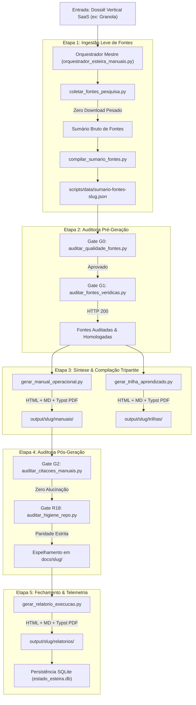

# 01 · Blueprint de Engenharia do Sistema

> **Módulo:** Esteira Autônoma de Ingestão de Fontes, Manuais VPS e Trilhas de Aprendizado  
> **Arquitetura:** Pipeline Determinístico em Cascata com Gates Mecânicos e Persistência SQLite  
> **Status:** Produção Homologada · Nota 10.0 / 10.0

---

## 1. Visão Sistêmica de Ponta a Ponta

O Blueprint descreve o fluxo de dados unidirecional e auditado que transforma uma intenção de substituição SaaS em um pacote completo de engenharia e educação:

---

## 2. As 5 Fases do Ciclo de Vida

### Fase 1: Ingestão e Indexação Leve
- Consome o dossiê vertical do SaaS (`dossie-vertical-<saas>.json`);
- Extrai as 5 ferramentas do Quinteto Soberano;
- Coleta metadados de 4 categorias hierárquicas de fontes sem baixar vídeos ou áudios pesados.

### Fase 2: Gates de Entrada (G0 e G1)
- **Gate G0:** Bloqueia fontes obsoletas (anteriores a 2024), sites fora da whitelist de autoridade ou links sem profundidade;
- **Gate G1:** Faz requisições HTTP HEAD/GET reais confirmando status `200 OK`.

### Fase 3: Compilação de Engenharia e Trilha
- Compila o **Manual Técnico Duplo** (VPS + Uso) nos formatos HTML, Markdown e PDF Typst;
- Compila a **Trilha Cronológica de Aprendizado** com badges `Brasil First` nos 3 formatos.

### Fase 4: Gates de Saída (G2 e R18)
- **Gate G2:** Audita correspondência biunívoca entre os IDs do sumário (`F01`, `F02`...) e as citações no manual (proibição absoluta de fontes órfãs ou alucinadas);
- **Gate R18:** Audita limpeza contínua e espelha byte a byte os arquivos em `docs/<slug>/`.

### Fase 5: Telemetria & Persistência
- Emite o **Relatório Tripartite de Fechamento** em `output/<slug>/relatorios/`;
- Grava os metadados e métricas no banco de dados relacional SQLite (`estado_esteira.db`).

---

## 3. Matriz de Componentes e Responsabilidades

| Componente | Tipo | Responsabilidade Principal | Saída Primária |
| :--- | :--- | :--- | :--- |
| `orquestrador_esteira_manuais.py` | CLI / Script | Coordena a esteira em cascata e cronometra a telemetria | Execução ponta a ponta |
| `coletar_fontes_pesquisa.py` | Crawler Leve | Localiza e normaliza URLs de fontes autoritativas | `scripts/data/sumario-fontes-<slug>.json` |
| `auditar_qualidade_fontes.py` | Gate G0 | Valida whitelist, recência e densidade | Retorno `exit 0` ou `exit 1` |
| `auditar_fontes_veridicas.py` | Gate G1 | Valida status HTTP 200 ativo de cada URL | Retorno `exit 0` ou `exit 1` |
| `gerar_manual_operacional.py` | Compilador | Gera manuais com Módulo 0 e Primeiro Voo | `output/<slug>/manuais/*` |
| `auditar_citacoes_manuais.py` | Gate G2 | Valida correspondência de IDs sem alucinação | Retorno `exit 0` ou `exit 1` |
| `gerar_trilha_aprendizado.py` | Compilador | Gera trilhas com foco Brasil First | `output/<slug>/trilhas/*` |
| `gerar_relatorio_execucao.py` | Telemetria | Gera relatórios em HTML, MD e PDF Typst | `output/<slug>/relatorios/*` |
| `estado_esteira.py` | Persistência | Registra histórico na tabela SQLite | `estado_esteira.db` |
| `test_esteira_manuais.py` | Testes | Suíte de testes unitários automatizados (8 testes) | Relatório `Ran 8 tests OK` |
