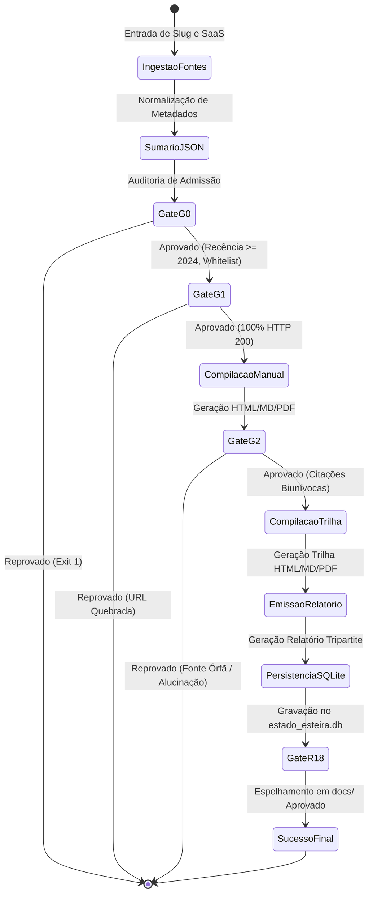

# 03 · Arquitetura do Sistema & Topologia Modular

> **Módulo:** Esteira Autônoma de Ingestão de Fontes, Manuais VPS e Trilhas de Aprendizado  
> **Padrão Arquitetural:** Bundles Autônomos em Árvore Modular com Espelhamento Estrito  
> **Status:** Produção Homologada · Nota 10.0 / 10.0

---

## 1. Topologia de Diretórios em Bundles Modulares

Para superar o problema do acúmulo desordenado de arquivos em diretórios planos (*flat*), a fábrica adota o padrão de **Bundles Autônomos de Ferramenta**. Cada ferramenta constitui um pacote autocontido com 9 artefatos divididos em 3 pastas canônicas:

```
output/
  └── [slug-ferramenta]/
        ├── manuais/
        │     ├── manual-[slug]-vps-e-uso.html  ➔ Visual interativo com Hero Stats e busca
        │     ├── manual-[slug]-vps-e-uso.md    ➔ Documento puro para Git e leitura offline
        │     └── manual-[slug]-vps-e-uso.pdf   ➔ DTP institucional compilado via Typst
        ├── trilhas/
        │     ├── trilha-[slug]-aprendizado.html ➔ Roteiro pedagógico com badges Brasil First
        │     ├── trilha-[slug]-aprendizado.md   ➔ Checklist Markdown de estudos
        │     └── trilha-[slug]-aprendizado.pdf  ➔ Guia em PDF para impressão e estudo
        └── relatorios/
              ├── DD-MM-YYYY-relatorio-execucao-[slug].html ➔ Dashboard web de telemetria
              ├── DD-MM-YYYY-relatorio-execucao-[slug].md   ➔ Registro Markdown auditável
              └── DD-MM-YYYY-relatorio-execucao-[slug].pdf  ➔ Laudo executivo formal via Typst
```

### Regra de Espelhamento Obrigatório (Regra R18)
Todo arquivo gerado em `output/<slug>/` é copiado e auditado com paridade de hash MD5 idêntica em `docs/<slug>/`. Isso garante que a documentação servida pelo GitHub Pages / MkDocs reflita rigorosamente os artefatos de entrega de produção.

---

## 2. Diagrama de Estados do Processamento

Cada ferramenta transita por uma máquina de estados finita rigorosamente controlada:



---

## 3. Estratégia de Navegação Relativa nos Artefatos

Os templates HTML utilizam caminhos relativos determinísticos, eliminando qualquer dependência de servidores web ativos para leitura local:

```
[Dossiê Vertical SaaS] 
   ▲  ../../listas-open-source/vert-<saas>.html
   │
   ├─► [Manual da Ferramenta] (output/<slug>/manuais/manual-*.html)
   │        │
   │        ├─► Link Cruzado: ../trilhas/trilha-*.html
   │        └─► Link Cruzado: ../relatorios/*-relatorio-*.html
   │
   └─► [Trilha da Ferramenta] (output/<slug>/trilhas/trilha-*.html)
            │
            ├─► Link Cruzado: ../manuais/manual-*.html
            └─► Link Cruzado: ../relatorios/*-relatorio-*.html
```

Essa malha de links cruzados garante ao leitor navegar livremente entre o manual de engenharia, a trilha de estudos, o relatório de telemetria e o dossiê comparativo de custos com um único clique.
