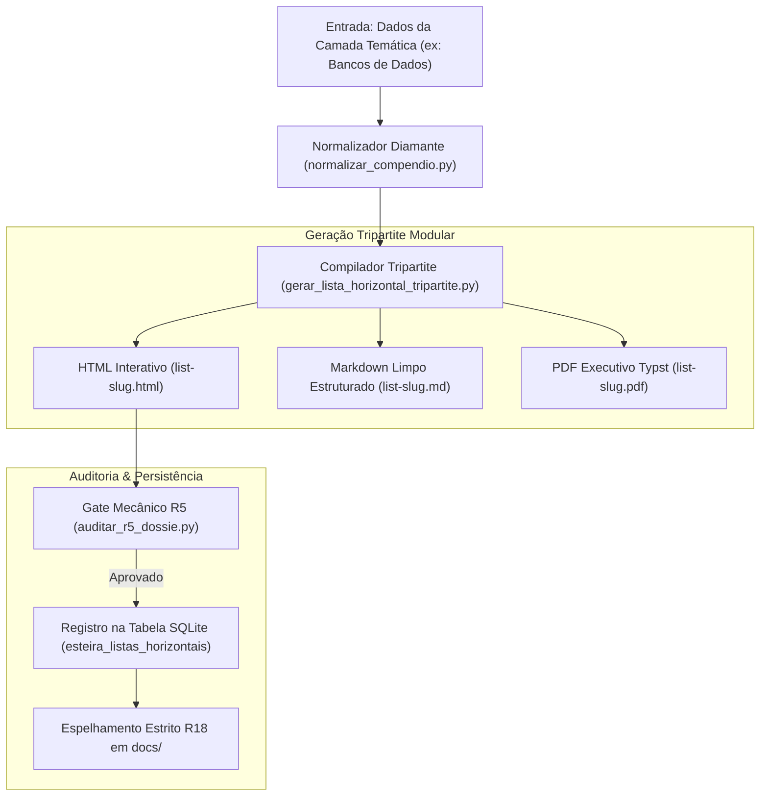

# 01 · Blueprint de Engenharia (Fluxo 1: Listas Horizontais)

> **Módulo:** Fluxo 1 — Listas Horizontais & Compêndios Temáticos  
> **Arquitetura:** Esteira Determinística Tripartite com Gate R5 e SQLite R11

---

## 1. Diagrama de Fluxo de Dados

---

## 2. Matriz de Componentes e Responsabilidades

| Componente | Tipo | Responsabilidade Principal | Saída Primária |
| :--- | :--- | :--- | :--- |
| `normalizar_compendio.py` | Compilador | Normaliza HTMLs legados no Padrão Diamante R5 | HTML estruturado |
| `gerar_lista_horizontal_tripartite.py` | Compilador | Gera simultaneamente HTML, MD e Typst PDF | `output/listas-tematicas/list-<slug>/*` |
| `auditar_r5_dossie.py` | Gate R5 | Valida Hero Stats, busca client-side e cards | Retorno `exit 0` ou `exit 1` |
| `test_fluxo1_listas.py` | Testes | Suíte de testes unitários automatizados | 5 testes passando em <1s |
| `estado_esteira.py` | Persistência | Registra histórico na tabela `esteira_listas_horizontais` | `estado_esteira.db` |
