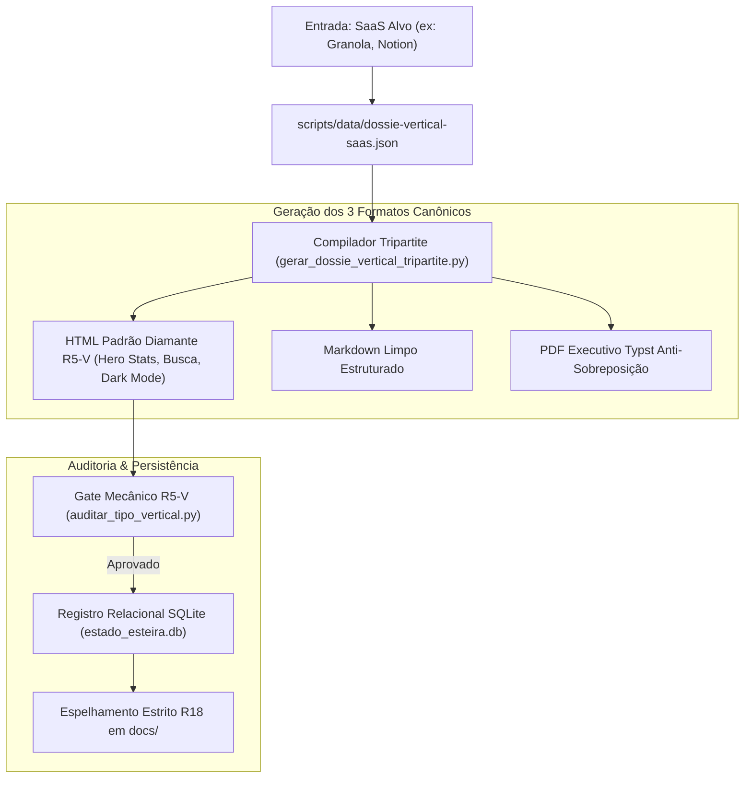

# 01 · Blueprint de Engenharia (Fluxo 2: Dossiês Verticais)

> **Módulo:** Fluxo 2 — Dossiês Verticais de Desmantelamento SaaS  
> **Arquitetura:** Esteira Determinística Tripartite com Gate Mecânico R5-V e SQLite R11

---

## 1. Diagrama de Fluxo de Dados

---

## 2. Matriz de Componentes e Responsabilidades

| Componente | Tipo | Responsabilidade Principal | Saída Primária |
| :--- | :--- | :--- | :--- |
| `dossie_vertical.schema.json` | Contrato JSON | Validação formal do Quinteto e Seções 5 e 6 | Schema válido |
| `gerar_dossie_vertical_tripartite.py` | Compilador | Gera simultaneamente HTML, MD e Typst PDF | `output/dossies-verticais/vert-<saas>/*` |
| `template_dossie_vertical.typ` | Molde Typst | Renderização gráfica sem sobreposição | Arquivo PDF executivo |
| `auditar_tipo_vertical.py` | Gate R5-V | Validação mecânica das 5 classificações e MCPs | Retorno `exit 0` ou `exit 1` |
| `test_fluxo2_verticais.py` | Testes | Suíte de testes unitários automatizados | 6 testes passando em <1s |
| `estado_esteira.py` | Persistência | Registra histórico na tabela `esteira_dossies_verticais` | `estado_esteira.db` |
