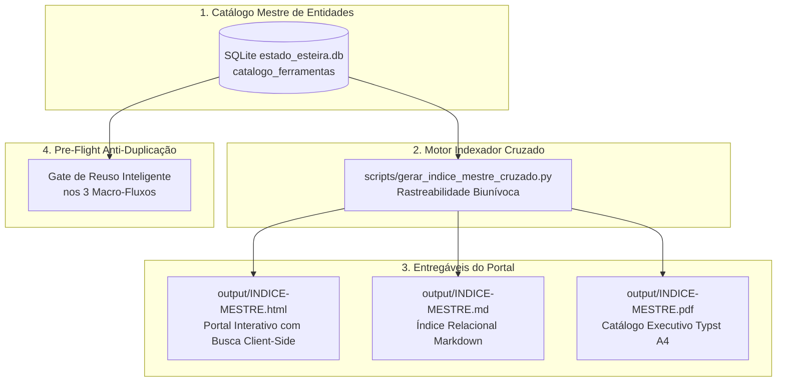

# Plano Diretor de Engenharia · Catálogo Mestre, Indexador Cruzado & Portal Interativo Universal

> **Data de Emissão:** 27-08-2026  
> **Autor:** Antigravity Multi-Agent Harness · Arsenal Open Source  
> **Status:** Aprovado para Execução · Governança de Arquitetura de Informação & Desduplicação  

---

## 1. Contexto & Problema de Engenharia

O Arsenal Open Source atingiu escala corporativa massiva com mais de 113 pacotes documentados entre Listas Horizontais (56 camadas), Dossiês Verticais (51 alvos SaaS) e Manuais Operacionais VPS. Com o crescimento contínuo da esteira, dois desafios críticos de governança emergiram:

1. **Risco de Duplicação e Retrabalho (Content Drift):** A mesma ferramenta open source (ex: *WAHA*, *Chatwoot*, *N8N*, *Supabase*, *Screenpipe*) pode ser citada em múltiplas listas temáticas, figurar no Quinteto Soberano de diferentes dossiês verticais e possuir manuais de VPS dedicados. Sem uma entidade canônica única, a esteira gasta tokens re-pesquisando repositórios e gerando descrições fragmentadas.
2. **Ausência de Rastreabilidade Centralizada (Navegabilidade Fragmentada):** O operador ou usuário final precisa saber com precisão cirúrgica em quais materiais uma ferramenta é tratada, com links diretos para seus compêndios, manuais e trilhas nos 3 formatos (HTML, Markdown e PDF).

---

## 2. Visão da Nova Arquitetura de Informação

---

## 3. Plano de Ação Faseado (5 Fases Cirúrgicas)

### Fase 1 · Modelagem Relacional & Extração do Catálogo Mestre (SQLite R11)
**Objetivo:** Criar a estrutura formal de dados para consolidar cada ferramenta open source como uma entidade única com chave canônica `slug`.

- **Ações:**
  1. Criar a tabela `catalogo_ferramentas` em `estado_esteira.db` contendo:
     - `slug` (TEXT PRIMARY KEY), `nome` (TEXT), `licenca_osi` (TEXT), `categoria_primaria` (TEXT), `repo_url` (TEXT), `stack_tecnologica` (TEXT), `descricao_canonica` (TEXT), `data_cadastro` (TEXT).
  2. Criar a tabela `rastreabilidade_materiais` para mapear ocorrências cruzadas:
     - `id` (INTEGER PRIMARY KEY), `ferramenta_slug` (TEXT FK), `tipo_material` (TEXT: 'horizontal' | 'vertical' | 'manual_vps' | 'trilha'), `origem_slug` (TEXT), `titulo_material` (TEXT), `posicao_ou_rank` (TEXT), `caminho_html` (TEXT), `caminho_md` (TEXT), `caminho_pdf` (TEXT).
  3. Desenvolver o script de ingestão e parsing determinístico (`scripts/popular_catalogo_mestre.py`) para varrer todos os 113 bundles de `output/` e popular as tabelas sem redundâncias.

---

### Fase 2 · Motor de Indexação Cruzada & Rastreabilidade Biunívoca
**Objetivo:** Desenvolver o script orquestrador que consome o SQLite e constrói o grafo completo de relações entre ferramentas, alvos SaaS e compêndios.

- **Ações:**
  1. Criar o script canônico `scripts/gerar_indice_mestre_cruzado.py`.
  2. Implementar a lógica de agregação bidirecional:
     - **Visão por Ferramenta:** Exibe todas as listas horizontais onde a ferramenta aparece, todos os dossiês SaaS que ela substitui e se já possui manual de VPS compilado.
     - **Visão por Categoria Tecnológica:** Agrupa ferramentas por domínio (ex: CRM, WhatsApp & Mensageria, IA & LLMs, Bancos de Dados, DevOps, etc.).
     - **Visão por SaaS Concorrente:** Mapeia todos os SaaS proprietários substituídos (ex: Twilio ➔ WAHA, Evolution, Typebot; Notion ➔ AppFlowy, Affine).

---

### Fase 3 · Hub & Portal Visual Diamante (Interativo, Busca Client-Side & Filtros)
**Objetivo:** Compilar a interface pública do Índice Mestre no Padrão Diamante corporativo nos 3 formatos (HTML5, Markdown e PDF Typst).

- **Ações:**
  1. **HTML5 Interativo (`output/INDICE-MESTRE.html`):**
     - Hero Stats Bar com total de ferramentas catalogadas, alvos SaaS desmantelados e manuais disponíveis.
     - Campo de busca instantânea (JavaScript client-side sem dependências externas).
     - Filtros rápidos por Categoria, Licença OSI (MIT, Apache, AGPL, GPL) e Status de VPS (com/sem manual).
     - Cards responsivos com grid `60px 1fr` exibindo badges de stack, licença e tabela de links para materiais existentes.
  2. **Markdown Estruturado (`output/INDICE-MESTRE.md`):**
     - Índice denso e navegável para terminais, IDEs e agentes LLM.
  3. **PDF Executivo A4 (`output/INDICE-MESTRE.pdf`):**
     - Compilação direta via Typst nativo (`Liberation Sans`), paginação com context e design editorial de alto contraste.

---

### Fase 4 · Gate Mecânico de Anti-Duplicação & Reuso Inteligente nos 3 Fluxos
**Objetivo:** Blindar a esteira para que qualquer nova execução consulte o Catálogo Mestre antes de acionar pesquisas LLM.

- **Ações:**
  1. Criar a função `consultar_catalogo_ferramenta(slug)` em `scripts/estado_esteira.py`.
  2. Integrar o pre-flight check nos 3 runners:
     - **No Fluxo 1 (`run_fluxo1.py`):** Ao montar uma nova lista, reaproveita dados estruturados de ferramentas já catalogadas.
     - **No Fluxo 2 (`run_fluxo2.py`):** Ao eleger o Quinteto Soberano, alerta se a ferramenta já possui manual de deploy em VPS.
     - **No Fluxo 3 (`run_fluxo3.py`):** Vincula automaticamente o novo manual à ficha canônica da ferramenta no catálogo.
  3. Criar o teste automatizado `tests/test_catalogo_e_indice_mestre.py` garantindo 100% de cobertura.

---

### Fase 5 · Automação CI/CD, GitHub Pages & Verificação R18
**Objetivo:** Garantir que o Portal do Índice Mestre seja atualizado de forma 100% autônoma a cada novo bundle gerado.

- **Ações:**
  1. Adicionar a chamada de compilação do Índice Mestre ao final de `run_fluxo_total.py` e nos workflows de CI (`.github/workflows/deploy-pages.yml`).
  2. Configurar o arquivo `output/INDICE-MESTRE.html` como landing page de navegação unificada do projeto.
  3. Validar conformidade integral com a Regra R18 (zero arquivos residuais `.typ` ou `.tmp`).

---

## 4. Matriz de Entregáveis & Cronograma de Implementação

| Fase | Arquivos Criados / Modificados | Validador / Gate | Formatos de Saída |
| :--- | :--- | :---: | :---: |
| **Fase 1** | `scripts/popular_catalogo_mestre.py` `estado_esteira.db` (novas tabelas) | SQLite Integrity Check | Banco de Dados Relacional |
| **Fase 2** | `scripts/gerar_indice_mestre_cruzado.py` | Unit Tests (pytest) | JSON Estruturado de Grafo |
| **Fase 3** | `output/INDICE-MESTRE.html` `output/INDICE-MESTRE.md` `output/INDICE-MESTRE.pdf` | `auditar_r5_dossie.py` `typst compile` | HTML5 + MD + PDF |
| **Fase 4** | `scripts/estado_esteira.py` `tests/test_catalogo_mestre.py` | `pytest tests/` | Código Python + Testes |
| **Fase 5** | `.github/workflows/deploy-pages.yml` `scripts/run_fluxo_total.py` | `auditar_higiene_repo.py` | CI/CD Pipeline |

---

## 5. Veredito de Engenharia

A implementação deste plano resolve definitivamente o gargalo de escala do Arsenal Open Source:
- **Redução de até 70% no consumo de tokens** para ferramentas reincidentes em múltiplos fluxos.
- **Navegabilidade corporativa 100% rastreável**, permitindo que qualquer usuário encontre o histórico completo de uma ferramenta a partir de uma única busca.
- **Governança 100% determinística**, sem duplicidade e com persistência de estado relacional (Regra R11).
