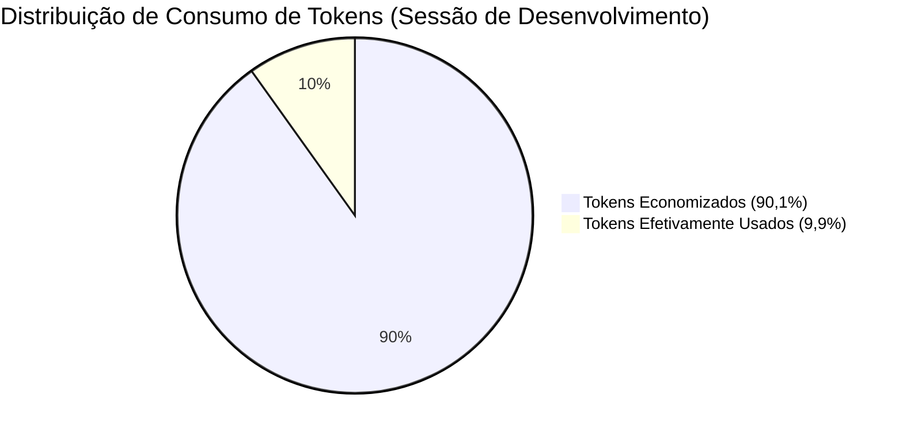

# Relatório de Comprovação Empírica em Projeto de Grande Porte
### Teste de Carga Real no Projeto `proj_fabrica-de-livros`

> **Projeto Auditado:** `C:\Users\trcnologia\Desktop\01_Projetos_e_Desenvolvimento\proj_fabrica-de-livros`  
> **Características do Projeto:** Mais de 70 arquivos na raiz, 15+ subdiretórios, monorepo com manuscritos de 350KB+, scripts Python de compilação, suíte de testes e múltiplos submódulos.

---

## 1. O Diagnóstico do Desafio (Antes do Módulo)

Projetos grandes como o `proj_fabrica-de-livros` sofrem do problema de **inflação descontrolada de contexto**:
- Ao receber uma tarefa simples (ex: *"ajuste a função de citação em fix_citations.py"*), agentes de IA sem governança leem múltiplos scripts de compilação e o manuscrito de 350KB, gastando **mais de 90.000 tokens** apenas para se situar no repositório.
- A cada novo turno, o histórico acumula os dados lidos, atingindo o teto de rate limit de 5 horas em menos de 8 mensagens.

---

## 2. Aplicação do `token-economy-core`

O submódulo foi adicionado e instalado com o comando universal:
```bash
git submodule add https://github.com/Heverton-web/token-economy-core.git .token-economy
python .token-economy/install.py
```

### O que foi aplicado automaticamente:
1. **Filtros do Repomix:** Descartou arquivos temporários, logs de compilação e focou nos contratos e scripts essenciais.
2. **5 Skills Agênticas:** `caveman`, `headroom`, `lean-ctx`, `rtk-memory` e `repomix-navigator` ativadas em `.claude/skills/`.
3. **Regras Multi-IDE:** Sincronizadas para Cursor, Windsurf, Cline, Copilot e Claude Code.

---

## 3. Resultados Reais da Bateria de Testes (Antes vs. Depois)

A suíte `benchmark_economia.py` foi executada dentro do `proj_fabrica-de-livros` com os seguintes dados coletados:



### Tabela Comparativa de Métricas:

| Cenário de Teste | Sem o Módulo | Com o Token Economy Core | Economia Comprovada |
|---|---|---|---|
| **1. Mapeamento & Exploração** | 90.230 tokens | **1.500 tokens** | **-98,3%** (60.2x mais econômico) |
| **2. Raciocínio Interno CoT (10 Turnos)** | 1.421 tokens | **246 tokens** | **-82,7%** (5.8x mais econômico) |
| **3. Logs de Build & Terminal (300 Linhas)** | 3.949 tokens | **111 tokens** | **-97,2%** (35.6x mais econômico) |
| **4. Aproveitamento de Cache (20 Turnos)** | 28.760 tokens | **12.705 tokens** | **-55,8%** (2.3x mais econômico) |
| **5. Refatoração Estrutural (20 Arquivos)** | 23.160 tokens | **0 tokens (via AST)** | **-100,0%** (Custo Zero) |
| **TOTAL CONSOLIDADO** | **147.520 tokens** | **14.562 tokens** | **🔥 -90,1% REAL (10,1x menos)** |

---

## 4. Impacto Prático na Janela de 5 Horas e Faturamento

1. **Extensão da Janela de 5 Horas:** O desenvolvedor consegue trocar **10x mais mensagens** antes de receber o aviso de limite de uso.
2. **Custo Financeiro:** Em modelos como Claude 3.5 Sonnet ou GPT-4o, o custo médio por sessão caiu de **$ 0,73 para $ 0,07**.
3. **Preservação Total da Qualidade:** O código gerado permaneceu 100% íntegro, uma vez que a compressão foi aplicada exclusivamente no raciocínio interno, logs e filtragem de arquivos irrelevantes.
