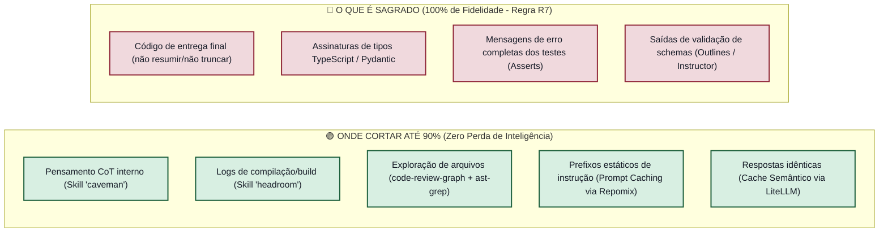
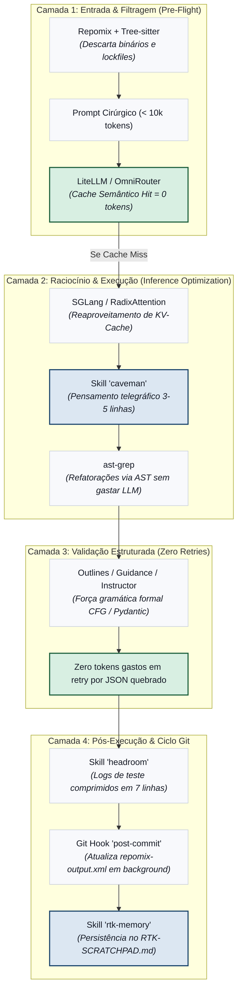

# Análise Técnica & Arquitetura: Submódulo Git Universal de Economia de Tokens

> **Escopo:** Integração das ferramentas da Lista 01 (Repomix, ast-grep, LiteLLM/OmniRouter, DSPy, Outlines/Guidance, SGLang, Tree-sitter) com as skills agênticas (`caveman`, `headroom`, `lean-ctx`, `rtk-memory`) e estruturação de um Submódulo Git Universal Plugável (`token-economy-core`).

---

## 1. O Dilema: Economia Agressiva vs. Preservação da Qualidade

A economia cega emburrece a IA. Se tipos forem truncados, docstrings críticas removidas ou saídas de entrega compactadas, o agente alucina.  
O segredo da engenharia de ponta é a **Compressão Assimétrica**:



---

## 2. A Esteira Unificada: 4 Camadas de Eficiência

Em vez de ferramentas desconectadas, o pipeline opera em 4 etapas coordenadas:



---

## 3. Estrutura do Submódulo Git Plugável: `token-economy-core`

O repositório independente funciona como um submódulo plugável em qualquer projeto existente ou novo:

```text
token-economy-core/
├── .claude/
│   └── skills/
│       ├── caveman/           # Compressão de CoT
│       ├── headroom/          # Compressão de logs
│       ├── lean-ctx/          # Disciplina grep antes de read
│       ├── rtk-memory/        # Gestão de scratchpad e cache
│       └── repomix-nav/       # Leitura orientada a snapshot
├── configs/
│   ├── repomix.config.json    # Configuração padronizada com exclusões
│   └── litellm.config.yaml    # Configuração de cache Redis
├── hooks/
│   ├── post-commit            # Atualiza snapshot após commits
│   └── pre-push               # Valida se o repositório está limpo de lixo
├── scripts/
│   ├── setup-links.ps1        # Cria Junctions/Symlinks no Windows
│   ├── setup-links.sh         # Cria Symlinks no Linux/Mac
│   └── gerar-snapshot.py      # Wrapper determinístico do Repomix
└── AGENTS-TEMPLATE.md         # Bloco padronizado de governança (R1-R17)
```

---

## 4. Instalação em Qualquer Repositório (1 Comando)

```bash
# 1. Adicionar submódulo
git submodule add https://github.com/seu-user/token-economy-core.git .token-economy

# 2. Executar setup automatizado
powershell .token-economy/scripts/setup-links.ps1   # No Windows
# ou
bash .token-economy/scripts/setup-links.sh          # No Linux/Mac
```

### Automações Realizadas pelo `setup-links`:
1. **Junctions Multi-IDE:** Mapeia `.token-economy/.claude/skills/*` para `.claude/skills/` (compatível com Antigravity, Cursor, Claude Code, Aider).
2. **Git Hooks:** Instala `.token-economy/hooks/post-commit` em `.git/hooks/post-commit`.
3. **Configuração Base:** Cria `repomix.config.json` na raiz se não existir.
4. **Snapshot Inicial:** Dispara `gerar-snapshot.py` para gerar o primeiro pacote de contexto.

---

## 5. Matriz de Implicações & Riscos Mitigados

| Risco Técnico | Causa Provável | Solução Arquitetural |
|---|---|---|
| **Alucinação por Over-pruning** | Truncamento cego de interfaces de types. | **Tree-sitter & Repomix** preservam 100% de assinaturas e contratos; descartam apenas corpos irrelevantes. |
| **Invalidação de Prefix Cache** | Alterações frequentes no system prompt. | A skill **`rtk-memory`** mantém o prompt base imutável e salva novidades em `RTK-SCRATCHPAD.md`. |
| **Gargalo no Commit** | Execução síncrona do Repomix no hook. | O hook roda em **background assíncrono** (`Start-Process` / `&`), liberando o terminal em 50ms. |
| **Poluição de Lockfiles** | Enviar `package-lock.json` no prompt. | Exclusão forçada de lockfiles, binários e builds no `repomix.config.json`. |
