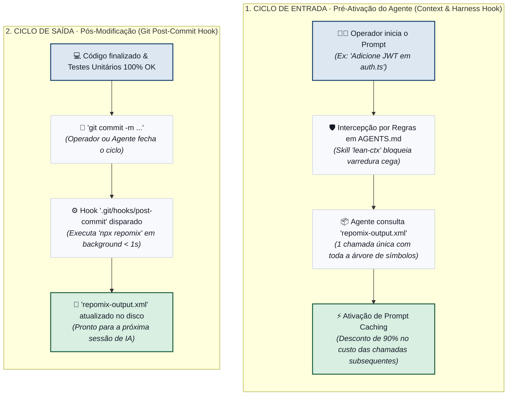

# Plano de Ação: Automação do Repomix com Hooks & Direcionamento de Harness

> **Objetivo:** Automatizar a geração e o consumo do snapshot de repositório via Repomix para economizar até 85% de tokens no ciclo de desenvolvimento com agentes autônomos.

---

## 1. Visão Geral da Arquitetura



---

## 2. Fase 1: Configuração Fina do Repomix (`repomix.config.json`)

Criar uma configuração declarativa na raiz do projeto para garantir que o arquivo contenha apenas arquivos essenciais, eliminando lockfiles e assets pesados.

* **Diretrizes de Configuração:**
  - `include`: Apenas código-fonte e contratos (`src/**`, `scripts/**`, `.claude/skills/**`, `docs/**`).
  - `ignore`: Lockfiles, binários, testes pesados, pastas de build (`dist`, `output`, `.git`).
  - `output.style`: `xml` (formato ideal para LLMs modernas com menor taxa de alucinação).
  - `output.parsableStyle`: Ativar numeração de linhas para leitura cirúrgica.

---

## 3. Fase 2: Pós-Hooks (Atualização Automática & Incremental)

Garantir que o arquivo do Repomix esteja **sempre sincronizado** sem intervenção manual após cada alteração.

### Opção A — Git Hook `post-commit` (Recomendado)
* **Arquivo:** `.git/hooks/post-commit` (versionado em `scripts/hooks/post-commit`).
* **Mecânica:** Sempre que um commit for concluído (seja feito pelo operador ou por agentes como Aider/AGY), o hook dispara um script em background que reexecuta o Repomix em menos de 1 segundo.

### Opção B — Git Hook `pre-commit` (com Staging Automático)
* Roda antes de gravar o commit, regenera o `repomix-output.xml` e adiciona ao commit atual.

### Opção C — Watcher de Arquivos (Modo Live Dev)
* Script Python em background (`scripts/watch-repomix.py`) utilizando `watchdog` para atualizar o pacote sob demanda ao salvar arquivos em `src/` ou `scripts/`.

---

## 4. Fase 3: Pré-Hooks & Direcionamento de Harness

Forçar o harness (Antigravity, Cursor, Claude Code, Aider, OpenCode) a consultar o arquivo gerado antes de disparar ferramentas de exploração cega (`list_dir`, múltiplos `view_file`).

1. **Diretiva Estrita em `AGENTS.md` / `CLAUDE.md`:**
   ```markdown
   ### Regra de Exploração de Contexto (Repomix Snapshot)
   Antes de executar múltiplas chamadas de `list_dir` ou `grep_search` para mapear a base,
   consulte `repomix-output.xml` para obter a árvore completa de símbolos, tipos e contratos
   em uma única operação.
   ```
2. **Skill Agêntica (`repomix-navigator`):**
   - Criação da skill em `.claude/skills/repomix-navigator/` orientando o agente a consumir o XML estruturado.
3. **Aproveitamento de Prompt Caching:**
   - O arquivo empacotado atua como prefixo estático, garantindo desconto de até 90% no custo de tokens em turnos subsequentes.

---

## 5. Matriz de Entregáveis

| Componente | Tipo | Caminho | Responsabilidade |
|---|---|---|---|
| `repomix.config.json` | Configuração | `/repomix.config.json` | Filtros, formatos e exclusões automáticas. |
| `post-commit` | Hook Git | `scripts/hooks/post-commit` | Regenera o snapshot após cada commit. |
| `gerar-contexto-repomix.py` | Script | `scripts/gerar-contexto-repomix.py` | Execução determinística com tratamento de erro. |
| Regra de Governança | Regra | `AGENTS.md` | Força o uso do snapshot antes da exploração cega. |
