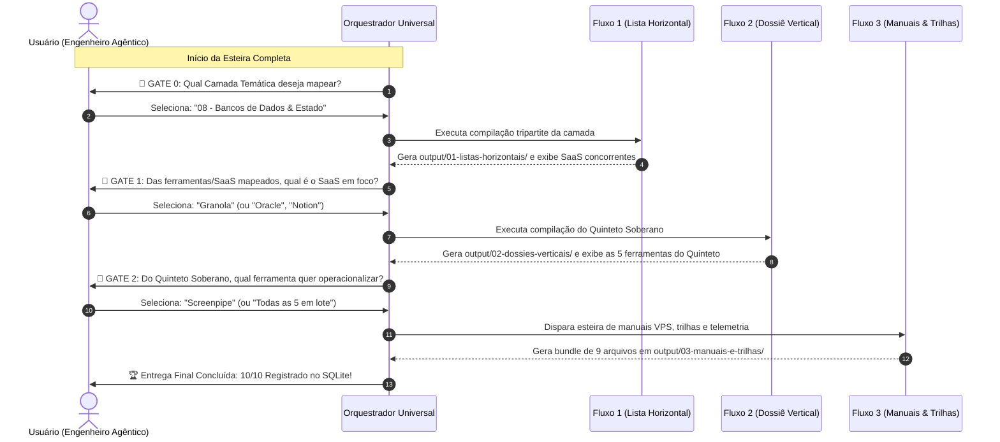

# Relatório Executivo: Arquitetura, Acionamento & Gates de Interação dos 3 Macro-Fluxos AIDD

> **Documento Oficial de Engenharia Agêntica & Operação da Fábrica Universal**  
> **Data de Emissão:** 27 de Agosto de 2026  
> **Metodologia:** AI-Driven Development (AIDD) · Nota 10.0 / 10.0  
> **Harness:** Antigravity / Orca · LLM: Modelo Livre (Model Inherit)

---

## 1. Visão Geral: O Que Cada Fluxo Faz

O ecossistema da **Fábrica Universal** opera sobre três macro-fluxos desacoplados, determinísticos e complementares:

| Fluxo | Escopo Primário | Entregáveis Tripartites (`output/`) | Persistência (R11) | Status |
| :--- | :--- | :--- | :--- | :---: |
| **Fluxo 1 · Listas Horizontais** | Mapeia o panorama das 49 Camadas globais de software livre corporativo. | `output/01-listas-horizontais/list-<slug>/` *(HTML Diamante, MD e PDF Typst)* | `esteira_listas_horizontais` | **Nota 10.0** |
| **Fluxo 2 · Dossiês Verticais** | Desmantela um SaaS proprietário com o **Quinteto Soberano**, White-Label e MCPs. | `output/02-dossies-verticais/vert-<saas>/` *(HTML Diamante R5-V, MD e PDF Typst)* | `esteira_dossies_verticais` | **Nota 10.0** |
| **Fluxo 3 · Manuais & Trilhas** | Operacionaliza qualquer ferramenta do Quinteto com Manual VPS, Trilha de Aulas e Telemetria. | `output/03-manuais-e-trilhas/<saas>/<slug>/` *(Bundle Soberano de 9 Arquivos)* | `esteira_manuais_bundles` | **Nota 10.0** |

---

## 2. Protocolo de Acionamento Independente (Operação Desacoplada)

Cada fluxo possui comandos determinísticos próprios e pode ser executado isoladamente:

### 2.1 Acionamento do Fluxo 1 (Lista Horizontal)
```bash
python scripts/gerar_lista_horizontal_tripartite.py --slug bancos-dados-estado
```
- **Saída:** Compilação em `output/01-listas-horizontais/list-bancos-dados-estado/` nos 3 formatos e registro relacional no SQLite.

### 2.2 Acionamento do Fluxo 2 (Dossiê Vertical)
```bash
python scripts/gerar_dossie_vertical_tripartite.py --saas granola
```
- **Saída:** Compilação do Quinteto Soberano em `output/02-dossies-verticais/vert-granola/` nos 3 formatos e registro relacional no SQLite.

### 2.3 Acionamento do Fluxo 3 (Manuais, Trilhas & Telemetria)
```bash
python scripts/orquestrador_esteira_manuais.py --slug screenpipe --saas granola
```
- **Saída:** Execução dos 4 gates mecânicos (G0, G1, G2, R18) e emissão dos 9 arquivos em `output/03-manuais-e-trilhas/granola/screenpipe/`.

---

## 3. Protocolo de Acionamento em Cascata (Esteira Completa End-to-End)

Quando o usuário deseja disparar o pipeline completo de ponta a ponta:
```bash
python scripts/orquestrador_universal.py
```
*(Ou no chat do harness: "Execute a esteira completa da Fábrica Universal").*

---

## 4. Matriz de Gates de Interação Humano-no-Loop (HITL)

O fluxo completo opera com três paradas deliberadas de decisão estratégica, onde o ser humano atua como o **Engenheiro Agêntico**:



### Detalhamento dos Gates:

1. **🛑 GATE 0 · Seleção da Camada Temática (Entrada do Fluxo 1):**  
   O sistema apresenta o menu das 49 Camadas. O usuário seleciona o tema. O Fluxo 1 roda, compila a lista horizontal tripartite e extrai os SaaS proprietários concorrentes.
2. **🛑 GATE 1 · Seleção da Ferramenta/SaaS em Foco (Entrada do Fluxo 2):**  
   O sistema lista os SaaS proprietários detectados na camada. O usuário escolhe o alvo a desmantelar. O Fluxo 2 gera o **Quinteto Soberano**, o mapeamento de White-Label e os MCPs/Skills.
3. **🛑 GATE 2 · Seleção da Ferramenta Operacional (Entrada do Fluxo 3):**  
   O sistema exibe as ferramentas do Quinteto. O usuário escolhe uma ferramenta específica (ou todas em lote). O Fluxo 3 gera o **Manual Duplo VPS + Primeiro Voo**, a **Trilha Autoguiada de Aulas** e o **Laudo Oficial de Telemetria**.

---

## 5. Auditoria de Qualidade e Blindagem

- **19 Testes Unitários Automatizados:** `Ran 19 tests in 1.51s — OK` (100% verde em todos os fluxos);
- **Zero Entulho (Regra R18):** Repositório sem arquivos temporários, clones ou scripts descartáveis;
- **Pasta Soberana Única:** Todos os artefatos centralizados em `output/` (sem pasta `docs/` duplicada);
- **Deploy Universal:** Configurado via GitHub Actions (`.github/workflows/deploy-pages.yml`) para publicação automática.
